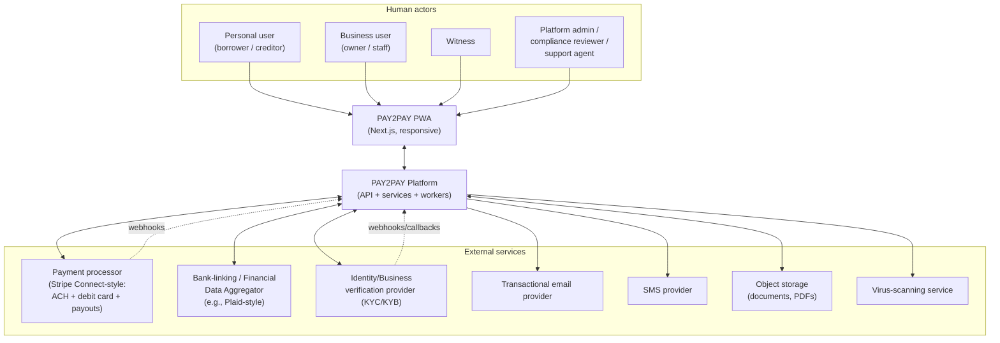
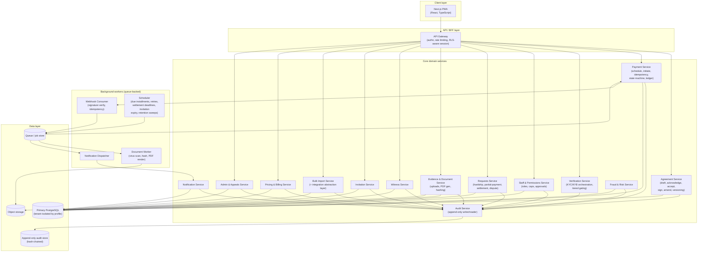
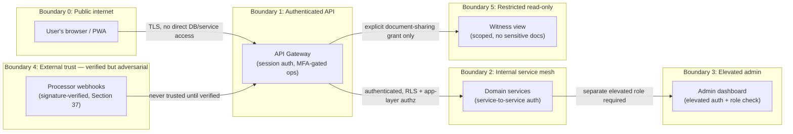
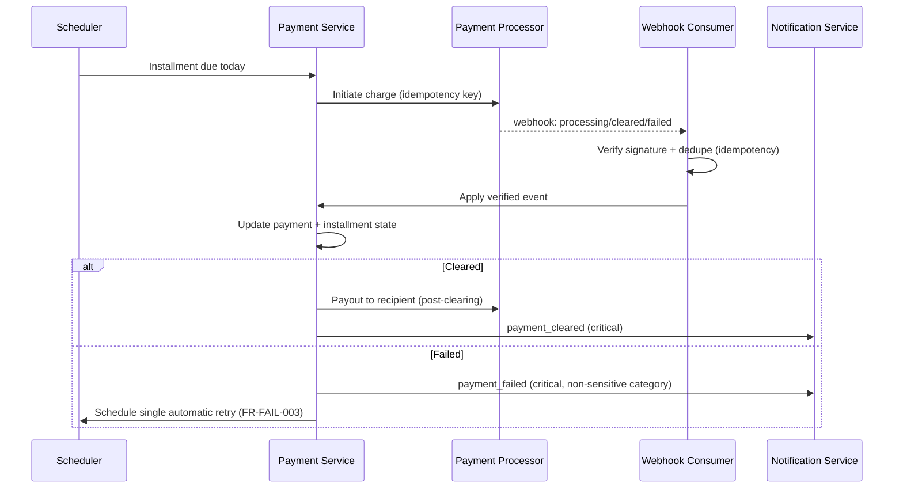
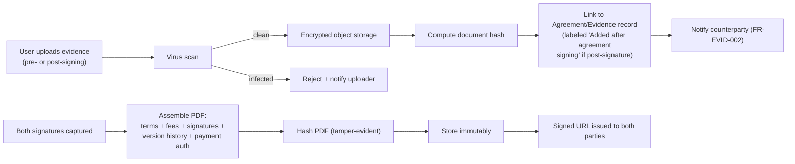
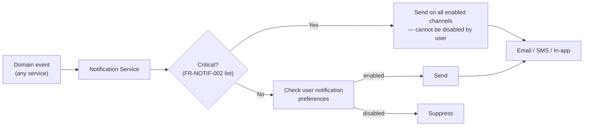

# Deliverable 6: System Architecture

Source: `docs/PAY2PAY_MASTER_SPEC.md`, primarily Section 33 (technical expectations) and the
payment/document/notification/audit rules threaded through Sections 6–9, 15, 21–23, 27, 29, 32.
Builds on `docs/deliverables/04-functional-requirements.md` (FR-*) and
`docs/deliverables/05-nonfunctional-requirements.md` (NFR-*). No application code or database
migrations are produced here — diagrams and prose only, per instruction.

## 0. Coverage across P2P, B2C, C2B, and B2B

The architecture is deliberately relationship-shape-agnostic at its core: every agreement has a
**creditor profile** and a **debtor profile**, and each profile is independently either a
**Personal profile** or a **Business profile** (FR-PROF-001, FR-B2B-001). The four relationship
shapes are simply the combinations of that pair, not four different code paths:

| Creditor | Debtor | Relationship | Distinguishing architectural requirements |
|---|---|---|---|
| Personal | Personal | P2P | Both sides Full personal verification (FR-IDV-001). |
| Business | Personal | B2C | Creditor completes business (KYB) verification; payout to business bank account (FR-B2B-004 pattern applied to a single-business agreement); business pricing applies to creditor. |
| Personal | Business | C2B | Debtor business completes KYB verification and designates an authorized representative for acknowledgment/signing (FR-B2B-002 pattern applied to a single-business agreement). |
| Business | Business | B2B | Both sides complete KYB verification and each designates a verified authorized representative (FR-B2B-001–010); per-business audit separation (FR-B2B-007); B2B dashboards (FR-B2B-010). |

Every component below (Agreement Service, Verification Service, Audit Service, Notification
Service, dashboards) is designed against this single `creditor_profile` / `debtor_profile` model
rather than against four separate feature sets. Where B2B specifically adds requirements (dual KYB,
authorized-representative validation, two-person/owner approval, per-business audit), those are
called out explicitly in the relevant component and flow sections below.

## 1. Context diagram



**External services and their role:**

- **Payment processor** — ACH and debit-card collection from the payer, tokenized payment-method
  storage, connected/verified recipient accounts, and payouts (§6, §7, §33). Evaluated against
  Stripe Connect, Stripe ACH Direct Debit, Stripe Financial Connections, Plaid Link/Transfer, or a
  qualified alternative (§6) — no provider is assumed approved (open decision #3).
- **Bank-linking / financial data aggregator** — bank-account ownership verification feeding both
  identity verification (§17) and payment-method setup; may be bundled with the payment processor
  (e.g., Stripe Financial Connections) or separate (e.g., Plaid).
- **Identity/business verification (KYC/KYB) provider** — government ID, selfie/liveness, legal
  name/DOB/address checks for individuals (§17), and legal-entity/EIN/beneficial-owner checks for
  businesses (§17, §18A). **The spec names no specific KYC/KYB vendor** (only payment-side
  providers are named in §6); this is a new open decision (see `docs/OPEN_DECISIONS.md` #16).
- **Transactional email / SMS providers** — critical and noncritical notifications (§23); vendor
  unnamed in the spec, an implementation detail rather than a business-risk open decision.
- **Object storage** — evidence documents, generated signed-agreement PDFs, with encryption and
  signed URLs (§27, §33).
- **Virus-scanning service** — inbound document uploads (§33: "virus scanning").

## 2. Component diagram



**Component notes:**

- **Agreement Service** owns the agreement lifecycle state machine (Deliverable 8) and version
  history; it is the only writer of `agreement` / `agreement_version` rows.
- **Payment Service** owns the payment lifecycle state machine, idempotency keys (FR-MONEY-002),
  and a double-entry-style internal ledger recording money movement even though the processor moves
  the actual funds (elaborated in Deliverable 9).
- **Verification Service** wraps the KYC/KYB provider, exposing a simple tier state
  (`none`/`basic`/`full`) to every other service rather than letting each service talk to the
  provider directly — this is also the natural point to enforce FR-IDV-003 (age gate) and the
  business-verification fields of FR-IDV-002.
- **Staff & Permissions Service** evaluates the owner-configured caps and two-person/owner-approval
  rules (FR-STAFF-002) and is consulted by Agreement/Requests services before allowing a staff
  member's action through — this is also where B2B's authorized-representative validation
  (FR-B2B-002) lives.
- **Requests Service** models hardship, partial-payment, settlement, and (agreement-level) dispute
  as a shared "counterparty-approval request" pattern (propose → review → accept/reject/counter →
  hand off to Agreement Service for a signed amendment), since all four share that shape in the spec.
- **Fraud & Risk Service** consumes events from every other service (agreement creation, payment
  failures, bank-account changes, settlement discounts, etc.) to evaluate the patterns in
  FR-FRAUD-002 and can itself call Admin & Appeals Service to apply a restriction.
- **Audit Service** is the single write path into the append-only audit store; every other service
  calls it rather than writing audit rows directly (enforces NFR-AUDIT-002).
- **Bulk Import Service** includes the integration abstraction layer required by FR-CSV-004 — CSV
  import is implemented as one concrete "connector" behind that abstraction so QuickBooks/Xero/etc.
  can be added later without changing the Agreement Service's draft-creation contract.

## 3. Trust boundaries



- **Boundary 0→1**: the browser never talks to the database, object storage, or payment processor
  directly; every action goes through the authenticated API gateway. Sensitive payment fields are
  only ever tokenized client-side by the processor's own SDK (client never sees raw PAN/account
  numbers to begin with — NFR-SEC-008).
- **Boundary 1→2**: the gateway enforces session validity, rate limiting (NFR-SEC-004), and
  MFA-gated actions (FR-MFA-001) before a request reaches a domain service; domain services then
  enforce row-level authorization *and* application-layer authorization independently
  (NFR-SEC-001 — RLS is one layer, not the whole strategy).
- **Boundary 2→3**: the admin dashboard is a distinct trust boundary requiring elevated
  authentication (§26, §29) and a specific administrator/compliance-reviewer/support-agent role;
  admin write actions are constrained to the allowed action set in FR-ADMIN-001/002 — the admin
  surface cannot reach agreement-mutation code paths that bypass the amendment/signature flow.
- **Webhook boundary**: inbound processor webhooks are treated as **untrusted input from a public
  endpoint** until signature-verified (NFR-SEC-005); only after verification and idempotency
  deduplication does an event cross into the trusted internal boundary.
- **Witness boundary**: a witness's read access is scoped per-agreement and per-explicitly-shared
  document; it is not a general reduced-privilege version of party access — it is a narrower,
  separately modeled grant (FR-WIT-002, FR-EVID-005), enforced at the API/authorization layer, not
  just hidden in the UI.
- **Cross-tenant boundary**: every tenant-scoped table carries a profile discriminator (personal or
  business) and RLS policies scope reads/writes to profile membership (NFR-PRIV-002); a business
  staff member's access is additionally scoped by their granted permissions within that business
  profile (FR-STAFF-002), modeled as a second authorization layer on top of profile membership.

## 4. Data flows

### 4.1 Agreement creation → signing → active

```mermaid
sequenceDiagram
    participant Initiator
    participant AGR as Agreement Service
    participant VER as Verification Service
    participant Counterparty
    participant PAYS as Payment Service
    participant AUDIT as Audit Service

    Initiator->>AGR: Create draft (terms, parties, schedule)
    AGR->>AUDIT: log draft_created
    AGR->>Counterparty: Invitation (Invitation Service)
    Counterparty->>VER: Complete Basic/Full verification (if borrower)
    Counterparty->>AGR: Acknowledge debt (if borrower) / Accept (if creditor)
    AGR->>AUDIT: log acknowledgment/acceptance
    Initiator->>AGR: Final review confirmed
    Counterparty->>AGR: Final review confirmed
    AGR->>AGR: Capture dual signatures (FR-SIG-001), MFA-gated
    AGR->>AUDIT: log signed, create AgreementVersion (immutable)
    AGR->>PAYS: Request first payment
    PAYS->>PAYS: Idempotent charge attempt via processor
    PAYS-->>AGR: Payment cleared
    AGR->>AGR: Transition to Active; activate recurring schedule
    AGR->>AUDIT: log status_active
```

### 4.2 Recurring installment payment



## 5. Webhook flows

All processor (and KYC/KYB provider) webhooks land on a dedicated, publicly reachable but
minimally trusted endpoint, per the trust-boundary model above:

1. Request received → **signature verified** against the provider's signing secret (NFR-SEC-005) —
   invalid signature is rejected immediately, not queued.
2. Event **deduplicated** by provider event ID against a processed-events table (FR-MONEY-003,
   NFR-REL-001) — a redelivered event is acknowledged but produces no second state change.
3. Verified, novel event is placed on the internal queue for the relevant domain service (Payment
   Service for payment events, Verification Service for KYC/KYB callbacks).
4. Domain service applies the event through its own state machine (Deliverable 8), which itself
   rejects invalid transitions rather than trusting the webhook payload's implied state blindly.
5. State change triggers Audit Service write (always) and Notification Service dispatch (for
   critical events per FR-NOTIF-002).
6. Processing failure after signature/dedupe (e.g., a downstream service outage) uses
   infrastructure-level retry with backoff (NFR-REL-002), distinct from the business-level payment
   retry — a redelivery of the same event remains a no-op once it does succeed, so retrying the
   *delivery* is safe.

## 6. Background job flows

Scheduler-driven jobs, all queue-backed and independently scalable (NFR-SCALE-002):

- **Installment due job** — finds installments due today across all active agreements, hands each
  to Payment Service for initiation.
- **Automatic retry job** — fires the single configured-delay retry for a specific failed payment
  (FR-FAIL-003), then stops; does not re-fire if already retried or already cured manually.
- **Settlement deadline job** — checks settlements past their deadline without full clearing and
  applies the pre-agreed failure consequence (FR-SETL-004).
- **Invitation expiry sweep** — expires invitation links past their TTL (FR-INV-002).
- **Retention/legal-hold sweep** — evaluates records whose retention window has lapsed and no legal
  hold is active, and applies the documented deletion/minimization policy (FR-RET-002/003); never
  auto-deletes a record under an active hold.
- **CSV import processing job** — runs validation/preview/duplicate-detection for a submitted
  import (FR-CSV-002) asynchronously so a large file doesn't block the uploading business's session
  (NFR-SCALE-003).

## 7. Document flows



- Evidence uploads never bypass virus scanning (§33) and are always hashed for tamper-evidence
  before being linked to the agreement record.
- Sensitive documents (government ID, bank-linking artifacts) are stored and accessed only through
  the Verification Service's own restricted path — they are never part of the general
  Evidence/Document flow shared with a counterparty or witness (FR-EVID-004, NFR-PRIV-001).
- Generated agreement PDFs are produced once per signature event (original) and once per signed
  amendment (new version) — never regenerated in place over an existing version (FR-SIG-003,
  FR-AGR-006).

## 8. Notification flows



- Critical events (agreement signing, amendment, every payment-state transition, bank/debit/payout
  changes, ACH revocation, hardship/partial/settlement requests, security events,
  staff-permission changes, account restriction — FR-NOTIF-002) are dispatched unconditionally.
- Noncritical reminders respect per-user channel preferences (FR-NOTIF-003).
- Notification dispatch is asynchronous (background worker) so a slow email/SMS provider never
  blocks the request that triggered it (NFR-PERF-002).

---

**Coverage note:** This deliverable implements Section 33's technical-stack expectations and the
architectural implications of Sections 6–9, 15, 21–23, 27, 29, 32, and 37, and is explicitly
structured around the P2P/B2C/C2B/B2B profile model from Section 18/18A (see Section 0 above). It
does not include application code, infrastructure-as-code, or database migrations.

*Next: Deliverable 7 — Data model.*
