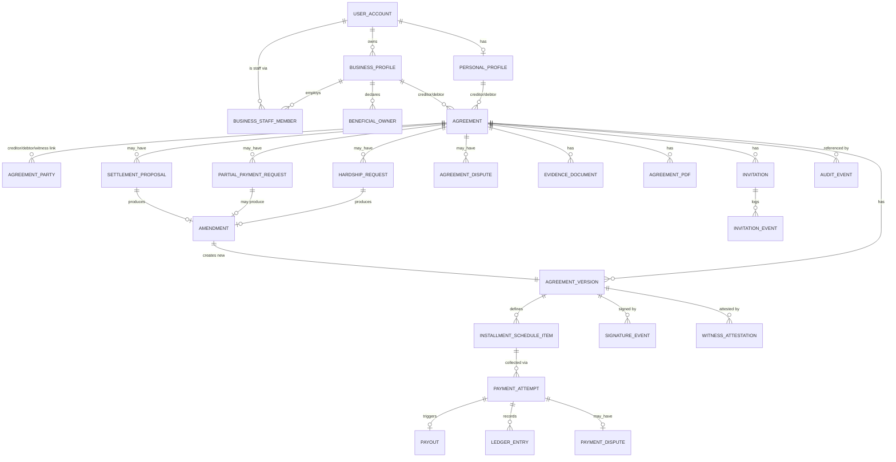

# Deliverable 7: Data Model

Source: `docs/PAY2PAY_MASTER_SPEC.md`, primarily Sections 3–32, and `docs/deliverables/04-functional-requirements.md`.
This is a **schema proposal for review**, not a production migration — no migration files are
created, and the DDL-style blocks below are illustrative documentation, matching the spec's
explicit instruction ("Do not write production migrations yet").

## 0. Coverage across P2P, B2C, C2B, and B2B

The model uses one **`agreement`** table for every relationship shape. Each agreement references a
`creditor_profile_id` and `debtor_profile_id`, and each of those FKs can point at either a
`personal_profile` or a `business_profile` row via a shared `profile` discriminator (Section 2
below). The relationship shape (P2P/B2C/C2B/B2B) is therefore a **derived value**, not a stored
type:

```
relationship_shape =
  CASE (creditor_profile.kind, debtor_profile.kind)
    WHEN ('personal', 'personal') THEN 'P2P'
    WHEN ('business', 'personal') THEN 'B2C'
    WHEN ('personal', 'business') THEN 'C2B'
    WHEN ('business', 'business') THEN 'B2B'
  END
```

B2B-specific requirements (dual KYB, authorized representative, per-business audit, two-person
approval) are modeled as *additional* rows/constraints that only apply when both sides are
`business` — see `business_staff_member.is_authorized_representative`, `staff_approval_request`,
and the `audit_event.profile_id` split in Sections 4 and 8 — not as a parallel schema.

## 1. Entity list (grouped by domain)

**Identity & profiles:** `user_account`, `personal_profile`, `business_profile`,
`beneficial_owner`, `business_staff_member`, `custom_role`, `permission_grant`,
`identity_verification_record`, `business_verification_record`, `device_session`.

**Agreements & versioning:** `agreement`, `agreement_version`, `agreement_party`,
`installment_schedule_item`, `signature_event`, `witness_attestation`.

**Payments & payouts:** `payment_method`, `payment_attempt`, `payout`, `ledger_entry`.

**Requests & amendments:** `hardship_request`, `partial_payment_request`, `settlement_proposal`,
`amendment` (generic wrapper created by any accepted request).

**Disputes:** `agreement_dispute`, `payment_dispute` (unauthorized-payment claim), `dispute_evidence_link`.

**Evidence & documents:** `evidence_document`, `agreement_pdf`.

**Invitations & notifications:** `invitation`, `invitation_event`, `notification`,
`notification_preference`.

**Business operations:** `csv_import_batch`, `csv_import_row`, `pricing_plan`, `pricing_tier`,
`subscription`, `staff_approval_request`.

**Trust & safety:** `audit_event`, `fraud_flag`, `account_restriction`, `appeal_case`,
`admin_action`.

## 2. Relationship diagram (core agreement domain)



*(A second, smaller diagram for Trust & Safety entities — `fraud_flag`, `account_restriction`,
`appeal_case`, `admin_action` — is omitted for space; each carries a nullable FK to
`user_account`/`business_profile`/`agreement` plus the fields listed in Section 4.)*

## 3. Profile/tenant discriminator (used throughout)

```sql
-- Illustrative only — not a migration.
CREATE TYPE profile_kind AS ENUM ('personal', 'business');

-- Every tenant-scoped table stores BOTH a profile_kind and a profile_id,
-- OR (preferred, shown here) references one concrete profile table and the
-- application resolves `kind` from which FK is populated. Shown as two
-- nullable FKs with a check constraint for clarity:
--   personal_profile_id IS NOT NULL XOR business_profile_id IS NOT NULL
```

## 4. Illustrative schema — core tables

```sql
-- ===== Identity & profiles =====

CREATE TABLE user_account (
  id                  UUID PRIMARY KEY DEFAULT gen_random_uuid(),
  email               CITEXT UNIQUE NOT NULL,
  phone               TEXT UNIQUE,
  auth_credential_ref TEXT NOT NULL,         -- passkey/password ref, not the secret itself
  date_of_birth       DATE,                  -- captured at Full verification (FR-IDV-003 age gate)
  status              TEXT NOT NULL DEFAULT 'active', -- active | suspended | closed
  country             TEXT NOT NULL DEFAULT 'US',      -- reserved per Section 1
  locale              TEXT NOT NULL DEFAULT 'en-US',
  timezone            TEXT NOT NULL DEFAULT 'America/New_York',
  created_at          TIMESTAMPTZ NOT NULL DEFAULT now(),
  updated_at          TIMESTAMPTZ NOT NULL DEFAULT now()
);

CREATE TABLE personal_profile (
  id                  UUID PRIMARY KEY DEFAULT gen_random_uuid(),
  user_id             UUID NOT NULL UNIQUE REFERENCES user_account(id), -- one personal profile per login (FR-PROF-001)
  legal_name          TEXT,
  residential_address JSONB,
  verification_tier   TEXT NOT NULL DEFAULT 'none', -- none | basic | full
  currency            TEXT NOT NULL DEFAULT 'USD',   -- reserved per Section 1
  created_at          TIMESTAMPTZ NOT NULL DEFAULT now()
);

CREATE TABLE business_profile (
  id                       UUID PRIMARY KEY DEFAULT gen_random_uuid(),
  owner_user_id            UUID NOT NULL REFERENCES user_account(id),   -- multiple per login allowed (FR-PROF-001)
  legal_business_name      TEXT NOT NULL,
  entity_type              TEXT NOT NULL,
  ein_or_ssn_ref           TEXT,                    -- tokenized/encrypted reference, not raw
  business_address         JSONB,
  verification_tier        TEXT NOT NULL DEFAULT 'none', -- none | basic | full
  currency                 TEXT NOT NULL DEFAULT 'USD',
  created_at                TIMESTAMPTZ NOT NULL DEFAULT now(),
  UNIQUE (owner_user_id, legal_business_name)      -- soft uniqueness guard, not a legal EIN constraint
);

CREATE TABLE beneficial_owner (
  id                  UUID PRIMARY KEY DEFAULT gen_random_uuid(),
  business_profile_id UUID NOT NULL REFERENCES business_profile(id),
  legal_name          TEXT NOT NULL,
  ownership_percent    NUMERIC(5,2),
  identity_verification_record_id UUID REFERENCES identity_verification_record(id)
);

CREATE TABLE business_staff_member (
  id                  UUID PRIMARY KEY DEFAULT gen_random_uuid(),
  business_profile_id UUID NOT NULL REFERENCES business_profile(id),
  user_id             UUID NOT NULL REFERENCES user_account(id),        -- individual login, never shared (FR-STAFF-001)
  role                TEXT NOT NULL,   -- owner | manager | receivables_staff | accountant_viewer | custom
  custom_role_id      UUID REFERENCES custom_role(id),
  is_authorized_representative BOOLEAN NOT NULL DEFAULT false, -- B2B: verified authority to
                                                                 -- create/negotiate/approve/sign/
                                                                 -- amend/settle/manage (FR-B2B-002)
  removed_at          TIMESTAMPTZ,     -- non-destructive removal (FR-STAFF-005); NULL = active
  created_at          TIMESTAMPTZ NOT NULL DEFAULT now(),
  UNIQUE (business_profile_id, user_id)
);

CREATE TABLE staff_approval_request (
  id                   UUID PRIMARY KEY DEFAULT gen_random_uuid(),
  business_profile_id  UUID NOT NULL REFERENCES business_profile(id),
  proposed_by_staff_id UUID NOT NULL REFERENCES business_staff_member(id),
  related_agreement_id UUID REFERENCES agreement(id),
  action_type          TEXT NOT NULL,   -- 'settlement' | 'principal_reduction' | 'schedule_change' | 'hardship_accept' | ...
  action_payload        JSONB NOT NULL, -- the specific proposed terms, for the approver to review
  reason_flagged          TEXT NOT NULL, -- which owner-configured cap/rule triggered mandatory approval (FR-STAFF-002)
  status                    TEXT NOT NULL DEFAULT 'pending', -- pending | approved | rejected
  approved_by_staff_id       UUID REFERENCES business_staff_member(id), -- distinct from proposer (two-person approval, FR-B2B-006)
  decided_at                    TIMESTAMPTZ,
  created_at                       TIMESTAMPTZ NOT NULL DEFAULT now(),
  CHECK (approved_by_staff_id IS NULL OR approved_by_staff_id <> proposed_by_staff_id)
);

CREATE TABLE custom_role (
  id                  UUID PRIMARY KEY DEFAULT gen_random_uuid(),
  business_profile_id UUID NOT NULL REFERENCES business_profile(id),
  name                TEXT NOT NULL,
  permissions         JSONB NOT NULL   -- granular flags/caps per FR-STAFF-002
);

CREATE TABLE identity_verification_record (
  id           UUID PRIMARY KEY DEFAULT gen_random_uuid(),
  profile_kind profile_kind NOT NULL,
  profile_id   UUID NOT NULL,          -- personal_profile.id or business_profile.id
  tier         TEXT NOT NULL,          -- basic | full
  status       TEXT NOT NULL,          -- pending | verified | rejected
  provider_ref TEXT,                   -- external KYC/KYB provider reference (see open decision #16)
  verified_fields JSONB,
  created_at   TIMESTAMPTZ NOT NULL DEFAULT now()
);

-- ===== Agreements & versioning =====

CREATE TYPE agreement_status AS ENUM (
  'draft', 'awaiting_payer_acknowledgment', 'awaiting_recipient_acceptance',
  'awaiting_signatures', 'signed', 'first_payment_pending', 'active', 'past_due',
  'disputed', 'paused_by_amendment', 'settled_in_full', 'paid_in_full',
  'canceled_by_mutual_agreement', 'closed'
);

CREATE TABLE agreement (
  id                     UUID PRIMARY KEY DEFAULT gen_random_uuid(),
  creditor_profile_kind  profile_kind NOT NULL,
  creditor_profile_id    UUID NOT NULL,
  debtor_profile_kind    profile_kind NOT NULL,
  debtor_profile_id      UUID NOT NULL,
  status                 agreement_status NOT NULL DEFAULT 'draft',
  currency               TEXT NOT NULL DEFAULT 'USD',       -- reserved per Section 1
  country                TEXT NOT NULL DEFAULT 'US',
  current_version_id     UUID,          -- FK added after agreement_version exists (illustrative)
  created_by_user_id     UUID NOT NULL REFERENCES user_account(id),
  created_at             TIMESTAMPTZ NOT NULL DEFAULT now(),
  closed_at              TIMESTAMPTZ,
  retention_until        TIMESTAMPTZ,   -- computed: closed_at + 7 years (FR-RET-001)
  legal_hold             BOOLEAN NOT NULL DEFAULT false,
  legal_hold_reason      TEXT
);
CREATE INDEX idx_agreement_creditor ON agreement (creditor_profile_kind, creditor_profile_id, status);
CREATE INDEX idx_agreement_debtor   ON agreement (debtor_profile_kind, debtor_profile_id, status);

CREATE TABLE agreement_version (
  id                  UUID PRIMARY KEY DEFAULT gen_random_uuid(),
  agreement_id        UUID NOT NULL REFERENCES agreement(id),
  version_number      INTEGER NOT NULL,
  parent_version_id   UUID REFERENCES agreement_version(id),
  is_original         BOOLEAN NOT NULL DEFAULT false,
  produced_by         TEXT NOT NULL,   -- 'initial_signing' | 'hardship_amendment' | 'settlement_amendment' | ...
  terms               JSONB NOT NULL,  -- full FR-AGR-002 field set snapshot
  document_hash       TEXT,            -- populated once signed (FR-SIG-001)
  signed_at           TIMESTAMPTZ,
  created_at          TIMESTAMPTZ NOT NULL DEFAULT now(),
  UNIQUE (agreement_id, version_number)
);
-- Immutability of a signed version is enforced by REVOKEing UPDATE on this table
-- for the application role once signed_at IS NOT NULL (trigger or role-level grant).

CREATE TABLE agreement_party (
  id           UUID PRIMARY KEY DEFAULT gen_random_uuid(),
  agreement_id UUID NOT NULL REFERENCES agreement(id),
  role         TEXT NOT NULL,   -- 'creditor' | 'debtor' | 'witness'
  profile_kind profile_kind,    -- NULL for witness (witness is always a personal user_account)
  profile_id   UUID,
  user_id      UUID REFERENCES user_account(id),  -- populated for witness, or resolvable via profile for parties
  UNIQUE (agreement_id, role, profile_id)
);

CREATE TABLE installment_schedule_item (
  id                    UUID PRIMARY KEY DEFAULT gen_random_uuid(),
  agreement_version_id  UUID NOT NULL REFERENCES agreement_version(id),
  sequence_number       INTEGER NOT NULL,   -- 0 = first payment
  due_date              DATE NOT NULL,
  amount_minor_units    BIGINT NOT NULL,    -- integer minor units, never float (FR-MONEY-001)
  status                TEXT NOT NULL DEFAULT 'scheduled', -- scheduled | paid | past_due | waived
  UNIQUE (agreement_version_id, sequence_number)
);
CREATE INDEX idx_installment_due ON installment_schedule_item (due_date, status);

CREATE TABLE signature_event (
  id                    UUID PRIMARY KEY DEFAULT gen_random_uuid(),
  agreement_version_id  UUID NOT NULL REFERENCES agreement_version(id),
  signer_user_id        UUID NOT NULL REFERENCES user_account(id),
  signer_role            TEXT NOT NULL,     -- creditor | debtor | authorized_representative
  signer_title           TEXT,              -- for B2B representative (FR-B2B-003)
  consent_captured       BOOLEAN NOT NULL,
  auth_method            TEXT NOT NULL,     -- passkey | authenticator_app | sms_fallback
  ip_address              INET NOT NULL,
  device_info             JSONB,
  timezone                TEXT NOT NULL,
  signed_at               TIMESTAMPTZ NOT NULL DEFAULT now()
);

CREATE TABLE witness_attestation (
  id                    UUID PRIMARY KEY DEFAULT gen_random_uuid(),
  agreement_version_id  UUID NOT NULL REFERENCES agreement_version(id), -- version-bound (FR-WIT-003)
  witness_user_id       UUID NOT NULL REFERENCES user_account(id),
  attested_at            TIMESTAMPTZ NOT NULL DEFAULT now(),
  ip_address              INET,
  device_info             JSONB,
  UNIQUE (agreement_version_id, witness_user_id)
);

-- ===== Payments & payouts =====

CREATE TYPE payment_status AS ENUM (
  'scheduled', 'submitted', 'processing', 'cleared', 'payout_pending', 'paid_out',
  'failed', 'returned', 'reversed', 'disputed', 'refunded', 'canceled'
);

CREATE TABLE payment_method (
  id                  UUID PRIMARY KEY DEFAULT gen_random_uuid(),
  profile_kind        profile_kind NOT NULL,
  profile_id          UUID NOT NULL,
  method_type         TEXT NOT NULL,   -- 'ach' | 'debit_card'
  processor_token     TEXT NOT NULL,   -- tokenized reference only (FR-PAYMETHOD-002)
  status               TEXT NOT NULL DEFAULT 'active',
  created_at            TIMESTAMPTZ NOT NULL DEFAULT now()
);

CREATE TABLE payment_attempt (
  id                       UUID PRIMARY KEY DEFAULT gen_random_uuid(),
  installment_schedule_item_id UUID REFERENCES installment_schedule_item(id), -- NULL for extra/settlement payments
  agreement_id             UUID NOT NULL REFERENCES agreement(id),
  payment_method_id        UUID NOT NULL REFERENCES payment_method(id),
  attempt_kind             TEXT NOT NULL,  -- 'scheduled' | 'manual' | 'automatic_retry' | 'extra' | 'settlement'
  amount_minor_units       BIGINT NOT NULL,
  status                    payment_status NOT NULL DEFAULT 'scheduled',
  idempotency_key           TEXT NOT NULL UNIQUE,          -- FR-MONEY-002
  processor_reference        TEXT,
  failure_category            TEXT,        -- non-sensitive category only (FR-FAIL-001)
  created_at                   TIMESTAMPTZ NOT NULL DEFAULT now(),
  updated_at                   TIMESTAMPTZ NOT NULL DEFAULT now()
);
CREATE INDEX idx_payment_attempt_agreement ON payment_attempt (agreement_id, status);

CREATE TABLE payout (
  id                UUID PRIMARY KEY DEFAULT gen_random_uuid(),
  payment_attempt_id UUID NOT NULL REFERENCES payment_attempt(id),
  recipient_profile_kind profile_kind NOT NULL,
  recipient_profile_id   UUID NOT NULL,
  amount_minor_units     BIGINT NOT NULL,
  status                  TEXT NOT NULL DEFAULT 'pending', -- pending | paid_out | failed | returned
  processor_payout_ref     TEXT,
  created_at                TIMESTAMPTZ NOT NULL DEFAULT now()
);

CREATE TABLE ledger_entry (
  id                UUID PRIMARY KEY DEFAULT gen_random_uuid(),
  payment_attempt_id UUID NOT NULL REFERENCES payment_attempt(id),
  entry_type         TEXT NOT NULL,   -- 'debit_payer' | 'credit_recipient' | 'fee' | 'reversal' | ...
  amount_minor_units  BIGINT NOT NULL,
  recorded_at          TIMESTAMPTZ NOT NULL DEFAULT now()
  -- double-entry pairing detailed in Deliverable 9
);

-- ===== Requests & amendments =====

CREATE TABLE amendment (
  id                    UUID PRIMARY KEY DEFAULT gen_random_uuid(),
  agreement_id          UUID NOT NULL REFERENCES agreement(id),
  source_request_type   TEXT NOT NULL,  -- 'hardship' | 'partial_payment' | 'settlement' | 'general'
  source_request_id     UUID,           -- FK to whichever *_request/*_proposal table applies
  resulting_version_id  UUID REFERENCES agreement_version(id),
  status                 TEXT NOT NULL DEFAULT 'proposed', -- see Deliverable 8
  created_at              TIMESTAMPTZ NOT NULL DEFAULT now()
);

CREATE TABLE hardship_request (
  id             UUID PRIMARY KEY DEFAULT gen_random_uuid(),
  agreement_id   UUID NOT NULL REFERENCES agreement(id),
  requested_by   UUID NOT NULL REFERENCES user_account(id),
  reason         TEXT NOT NULL,
  relief_type    TEXT NOT NULL,  -- new_date | pause | reduced_installments | revised_schedule
  proposed_effective_date DATE,
  proposed_terms JSONB,
  status         TEXT NOT NULL DEFAULT 'submitted',
  created_at     TIMESTAMPTZ NOT NULL DEFAULT now()
);

CREATE TABLE partial_payment_request (
  id                UUID PRIMARY KEY DEFAULT gen_random_uuid(),
  agreement_id      UUID NOT NULL REFERENCES agreement(id),
  installment_schedule_item_id UUID REFERENCES installment_schedule_item(id),
  proposed_amount_minor_units BIGINT NOT NULL,
  proposed_date      DATE NOT NULL,
  explanation          TEXT,
  remainder_treatment   TEXT,
  status                TEXT NOT NULL DEFAULT 'submitted',
  created_at              TIMESTAMPTZ NOT NULL DEFAULT now()
);

CREATE TABLE settlement_proposal (
  id                        UUID PRIMARY KEY DEFAULT gen_random_uuid(),
  agreement_id              UUID NOT NULL REFERENCES agreement(id),
  pre_settlement_balance_minor_units BIGINT NOT NULL,
  settlement_amount_minor_units      BIGINT NOT NULL,
  forgiven_amount_minor_units         BIGINT NOT NULL,
  deadline                             DATE NOT NULL,
  payment_mode                          TEXT NOT NULL,  -- one_time | scheduled
  failure_consequence                   TEXT NOT NULL,  -- restore_original | restore_stated | forgive_permanently | prior_agreement_controls
  status                                 TEXT NOT NULL DEFAULT 'proposed',
  created_at                              TIMESTAMPTZ NOT NULL DEFAULT now()
);

-- ===== Disputes =====

CREATE TABLE agreement_dispute (
  id             UUID PRIMARY KEY DEFAULT gen_random_uuid(),
  agreement_id   UUID NOT NULL REFERENCES agreement(id),
  raised_by      UUID NOT NULL REFERENCES user_account(id),
  category       TEXT NOT NULL,
  explanation    TEXT NOT NULL,
  status         TEXT NOT NULL DEFAULT 'opened',
  created_at     TIMESTAMPTZ NOT NULL DEFAULT now()
);

CREATE TABLE payment_dispute (
  id                 UUID PRIMARY KEY DEFAULT gen_random_uuid(),
  payment_attempt_id UUID NOT NULL REFERENCES payment_attempt(id),
  claimed_by         UUID NOT NULL REFERENCES user_account(id),
  status              TEXT NOT NULL DEFAULT 'claimed',  -- separate from agreement_dispute (FR-UPAY-006)
  created_at            TIMESTAMPTZ NOT NULL DEFAULT now()
);

-- ===== Evidence & documents =====

CREATE TABLE evidence_document (
  id              UUID PRIMARY KEY DEFAULT gen_random_uuid(),
  agreement_id    UUID NOT NULL REFERENCES agreement(id),
  uploaded_by     UUID NOT NULL REFERENCES user_account(id),
  document_type   TEXT NOT NULL,   -- invoice | receipt | contract | estimate | purchase_order | ...
  storage_ref     TEXT NOT NULL,
  document_hash   TEXT NOT NULL,
  is_post_signing BOOLEAN NOT NULL DEFAULT false,  -- drives the mandatory label (FR-EVID-002)
  sensitivity     TEXT NOT NULL DEFAULT 'shared',  -- 'shared' | 'sensitive_private' (gov id, bank creds — never in this table's shared view)
  uploaded_at     TIMESTAMPTZ NOT NULL DEFAULT now()
);

-- ===== Invitations =====

CREATE TABLE invitation (
  id                UUID PRIMARY KEY DEFAULT gen_random_uuid(),
  agreement_id      UUID NOT NULL REFERENCES agreement(id),
  invited_role       TEXT NOT NULL,  -- debtor | creditor | witness
  channel             TEXT NOT NULL, -- email | sms | whatsapp | other
  token_hash           TEXT NOT NULL UNIQUE,
  bound_email          CITEXT,
  bound_phone           TEXT,
  status                 TEXT NOT NULL DEFAULT 'created', -- created | delivered | opened | accepted | expired | revoked
  expires_at              TIMESTAMPTZ NOT NULL,
  created_at                TIMESTAMPTZ NOT NULL DEFAULT now()
);

CREATE TABLE invitation_event (
  id            UUID PRIMARY KEY DEFAULT gen_random_uuid(),
  invitation_id UUID NOT NULL REFERENCES invitation(id),
  event_type    TEXT NOT NULL,  -- created | delivered | opened | accepted | expired | revoked
  occurred_at    TIMESTAMPTZ NOT NULL DEFAULT now()
);

-- ===== Trust & safety =====

CREATE TABLE audit_event (
  id                  BIGSERIAL PRIMARY KEY,   -- append-only; sequential for hash-chaining
  actor_user_id       UUID,
  actor_role          TEXT,
  profile_kind        profile_kind,
  profile_id          UUID,
  agreement_id        UUID,
  action              TEXT NOT NULL,
  occurred_at          TIMESTAMPTZ NOT NULL DEFAULT now(),
  ip_address            INET,
  device_info           JSONB,
  previous_value         JSONB,
  new_value               JSONB,
  reason                  TEXT,
  auth_strength            TEXT,
  related_document_id      UUID,
  related_case_id           UUID,
  event_hash                 TEXT NOT NULL,     -- hash(payload + previous row's event_hash)
  previous_event_hash          TEXT
);
-- No UPDATE or DELETE grant on this table for the application role (NFR-AUDIT-002).

CREATE TABLE account_restriction (
  id             UUID PRIMARY KEY DEFAULT gen_random_uuid(),
  user_id         UUID REFERENCES user_account(id),
  business_profile_id UUID REFERENCES business_profile(id),
  restriction_type TEXT NOT NULL,  -- additional_verification | manual_review | payment_restriction | payout_hold | agreement_creation_restriction | suspension
  reason           TEXT NOT NULL,
  applied_by_admin_id UUID NOT NULL,
  is_permanent      BOOLEAN NOT NULL DEFAULT false,
  status              TEXT NOT NULL DEFAULT 'active', -- active | lifted
  created_at            TIMESTAMPTZ NOT NULL DEFAULT now()
);

CREATE TABLE appeal_case (
  id                    UUID PRIMARY KEY DEFAULT gen_random_uuid(),
  account_restriction_id UUID NOT NULL REFERENCES account_restriction(id),
  case_number             TEXT NOT NULL UNIQUE,
  filed_by_user_id         UUID NOT NULL REFERENCES user_account(id),
  reviewer_admin_id          UUID,   -- CHECK (reviewer_admin_id <> account_restriction.applied_by_admin_id) enforced in app layer
  status                       TEXT NOT NULL DEFAULT 'filed', -- filed | under_review | upheld | denied
  decision_rationale             TEXT,
  decided_at                       TIMESTAMPTZ,
  created_at                         TIMESTAMPTZ NOT NULL DEFAULT now()
);
```

## 5. Versioning strategy

- `agreement_version` is append-only per agreement: the initial signed version has
  `is_original = true`; every accepted amendment (hardship, partial-payment, settlement, or general
  term change) inserts a **new row** with `parent_version_id` pointing at the version it amends.
- `agreement.current_version_id` always points at the latest signed version; historical versions
  remain queryable and are never mutated once `signed_at` is set (enforced by revoking UPDATE at
  the database role level once that column is non-null — FR-AGR-006).
- `installment_schedule_item` rows belong to a specific `agreement_version_id`, so an amendment
  that changes the schedule creates a new set of schedule items under the new version rather than
  editing the old ones — the original schedule remains reconstructable.

## 6. Audit strategy

- `audit_event` is `BIGSERIAL`-keyed and hash-chained: each row's `event_hash` is computed over its
  own payload plus the previous row's `event_hash`, so any retroactive edit breaks the chain
  (FR-AUDIT-003, NFR-AUDIT-002).
- The application's database role has `INSERT`-only privilege on `audit_event`; no role used by the
  application (including the admin surface) has `UPDATE`/`DELETE` on it. Deletion, if ever
  operationally required (e.g., a confirmed legal erasure order), goes through a documented,
  separately audited out-of-band process — not the application.
- Every domain service writes through the shared Audit Service (Deliverable 6, Section 2) rather
  than inserting directly, so the audit-write path is uniform.

## 7. Soft-delete strategy

- Given the seven-year retention requirement (FR-RET-001) and immutability requirements
  (FR-AGR-006), **agreements, versions, signatures, payments, and audit events are never hard-deleted.**
  "Deletion" for these is represented by status (`closed`, `canceled_by_mutual_agreement`) plus the
  `retention_until` / `legal_hold` fields on `agreement` — not row removal.
- Genuinely deletable data is narrower: account-level PII not tied to a retained record (e.g., an
  unused personal profile with no agreements) may be hard-deleted or nulled on request
  (FR-RET-003, NFR-PRIV-003), gated by a `deleted_at` soft-delete marker plus a scheduled purge job
  that only removes rows with `deleted_at` set, no active `legal_hold`, and no in-retention linked
  agreement.
- This distinguishes **soft delete** (hide from active UI, e.g., a removed staff member via
  `business_staff_member.removed_at`, FR-STAFF-005) from **purge** (actual removal, only after
  retention/hold checks clear) — the two are never conflated.

## 8. Retention fields

- `agreement.retention_until` = `closed_at + 7 years`, recalculated forward (not shortened) if a
  new hold/extension trigger applies (FR-RET-002: active dispute, fraud investigation, litigation
  hold, subpoena, processor requirement).
- `agreement.legal_hold` / `legal_hold_reason` — when true, retention/purge jobs skip this row and
  every row that references it (versions, payments, evidence, audit events) regardless of
  `retention_until`.
- The backup-lifecycle reconciliation with these fields (i.e., ensuring backups don't outlive or
  undercut this policy) is **not fully specified** — carried forward as open decision #15.

## 9. Indexes (representative, not exhaustive)

- `agreement (creditor_profile_kind, creditor_profile_id, status)` and the debtor equivalent — for
  dashboard queries (accounts payable/receivable, FR-B2B-010).
- `installment_schedule_item (due_date, status)` — for the Scheduler's due-installment job.
- `payment_attempt (agreement_id, status)` — for agreement-detail views and reconciliation.
- `invitation (token_hash)` unique — for O(1) secure link resolution without leaking existence via
  timing (paired with rate limiting, NFR-SEC-004).
- `audit_event (agreement_id, occurred_at)` and `audit_event (profile_kind, profile_id, occurred_at)`
  — for both agreement-scoped and profile-scoped audit review (FR-ADMIN-001, FR-B2B-007).

## 10. Uniqueness constraints

- `payment_attempt.idempotency_key` — unique (FR-MONEY-002).
- `invitation.token_hash` — unique (FR-INV-002).
- `agreement_version (agreement_id, version_number)` — unique.
- `business_staff_member (business_profile_id, user_id)` — unique (one staff record per person per business).
- `witness_attestation (agreement_version_id, witness_user_id)` — unique (no duplicate attestation
  by the same witness on the same version).
- `appeal_case.case_number` — unique.
- `user_account.email` — unique; `user_account.phone` — unique when present.

## 11. Tenant and profile isolation model

- Every tenant-scoped table carries a `profile_kind` + `profile_id` pair (or, for `agreement`, two
  such pairs — creditor and debtor). Row-level security policies scope reads/writes to rows where
  the requesting session's profile membership matches one of these pairs.
- **Business staff access** is a second authorization layer on top of profile membership: a staff
  member's session is scoped to their `business_staff_member` row's `business_profile_id`, further
  narrowed by `custom_role.permissions` / role defaults (FR-STAFF-002) — RLS alone only proves "this
  business profile," not "this employee is allowed to do this specific thing," which is why
  NFR-SEC-001 requires an application-layer authorization check in addition to RLS.
- **Witness access** is not tenant membership at all — it is a narrow, explicit grant scoped to one
  `agreement_id` and only to `evidence_document` rows explicitly marked shared with that witness,
  enforced at the application layer (FR-WIT-002, FR-EVID-005).
- **Cross-tenant leakage prevention**: a personal profile and any business profile(s) owned by the
  same `user_account` are still isolated from each other as if they were unrelated tenants
  (NFR-PRIV-002) — the shared `owner_user_id` is a convenience link for the owner's own
  cross-profile switcher UI, not an authorization shortcut.

---

**Coverage note:** This data model implements the entities implied by Sections 3–32 of the master
spec and the functional requirements in Deliverable 4, explicitly unified across P2P/B2C/C2B/B2B via
the `profile_kind` discriminator (Section 0/1 above). Credit-reporting forward-compatibility
(FR-CREDIT-002) is represented by reserving `settlement/consent`-style fields at the
`installment_schedule_item`/`agreement` level in a later pass rather than adding unused columns now;
this is noted rather than speculatively schema'd, consistent with `CLAUDE.md` rule 2 (not weakening
the spec) balanced against not inventing unrequested detail.

*Next: Deliverable 8 — State machines.*
