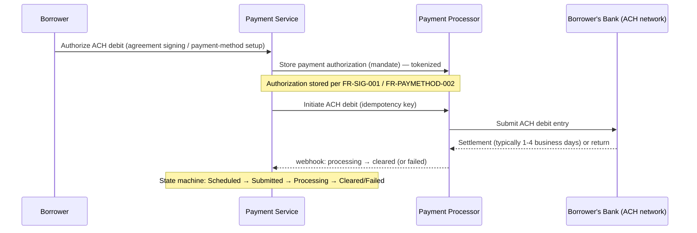
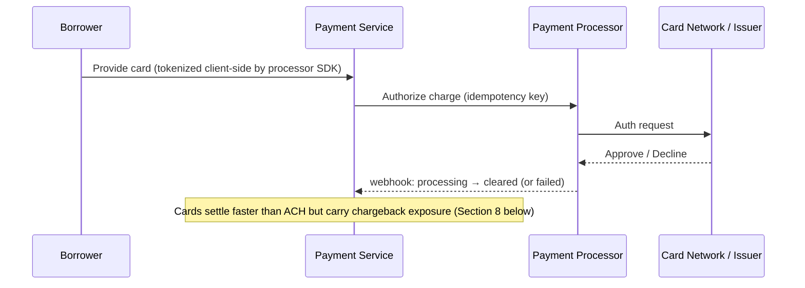
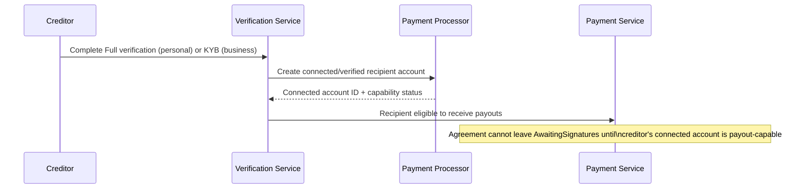
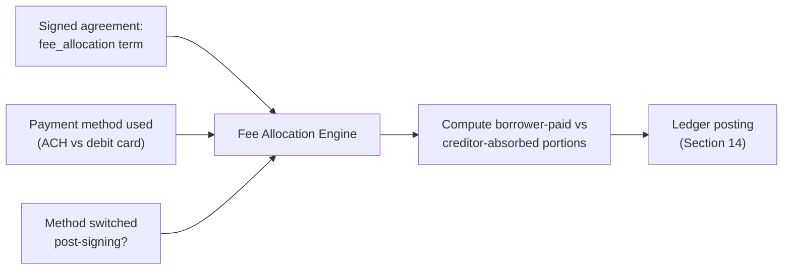
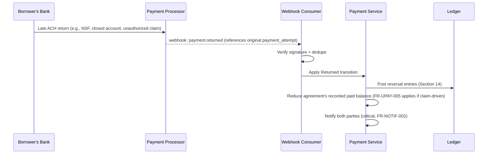
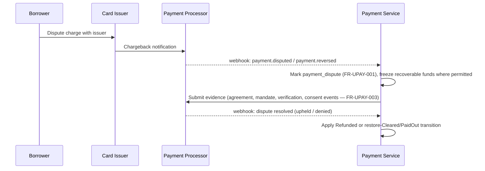
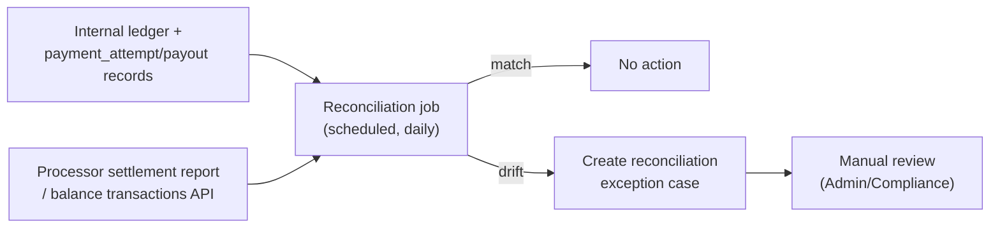

# Deliverable 9: Payment Architecture

Source: `docs/PAY2PAY_MASTER_SPEC.md`, primarily Sections 6, 7, 8, 14, 37. Builds directly on
`docs/ARCHITECTURE.md` (Payment Service, webhook trust boundary), `docs/DATA_MODEL.md`
(`payment_attempt`, `payout`, `ledger_entry`, `payment_method`), and `docs/PAYMENT_STATE_MACHINE.md`
(payment and payout lifecycles) — this deliverable does not repeat those state diagrams, it
explains the money-movement mechanics and ledger design that sit behind them.

## 0. Coverage across P2P, B2C, C2B, and B2B

Payment mechanics (ACH flow, debit-card flow, idempotency, webhook handling, reconciliation,
ledger) are identical regardless of relationship shape — a payment doesn't know whether its
`payment_attempt.agreement_id` belongs to a P2P, B2C, C2B, or B2B agreement. The two places
relationship shape *does* affect payment architecture:
- **Fee allocation** (Section 4 below) reads the signed agreement's fee-allocation term, and B2B
  agreements additionally apply business pricing to the creditor business (FR-B2B-004, FR-PRICE-004).
- **Connected recipient** (Section 3 below) resolves to whichever verified profile — personal or
  business — is the agreement's creditor; a B2B agreement's connected recipient is the creditor
  *business's* verified account, reached through its authorized representative's action, not a
  personal account.

## 1. ACH flow

- ACH is presented as the default, low-cost method (FR-PAYMETHOD-001, §6).
- Unlike card payments, ACH clearing is **not instantaneous confirmation of finality** — a debit
  that appears to clear can still be **returned** by the borrower's bank days later (insufficient
  funds, closed account, or an unauthorized-debit claim under standard ACH network rules). This is
  why the payment state machine models `Returned` as reachable even from `PaidOut`
  (`docs/PAYMENT_STATE_MACHINE.md` §1) — clearing is provisional until the return window standard
  to the processor's ACH rail has passed. The exact return window is a processor/network parameter,
  not a PAY2PAY business rule, and is confirmed once a processor is selected (open decision #3).
- The stored payment authorization (mandate) is exactly what FR-UPAY-003 requires to be preserved
  for an unauthorized-payment claim, and is what FR-AGR-008 lets the borrower revoke independently
  of the underlying agreement.

## 2. Debit-card flow

- Debit-card is the alternative method (§6); if a borrower switches from ACH to card after signing,
  the incremental processing cost defaults to the borrower per FR-PAYMETHOD-003 unless amended.
- Card payments fail differently from ACH: decline at authorization time (immediate, per
  FR-PAYMETHOD-004) versus ACH's delayed-return risk — the Payment Service's failure-category
  mapping (Section 6 below) distinguishes these for the non-sensitive notification required by
  FR-FAIL-001.

## 3. Connected recipient flow

- Every creditor (personal or business) must have a processor-side connected/verified account
  before their agreement can be signed — this is the mechanism through which FR-ROUTE-001 ("the
  platform does not intentionally receive customer funds into its own operating account") is
  actually achieved: money is routed processor-side, directly to this connected account, not
  through a PAY2PAY-controlled bank account.
- A B2B agreement's connected recipient is the **creditor business's** verified account; the
  authorized representative acts on its behalf but is not itself the payout destination
  (FR-B2B-004).
- Per §7's explicit constraint, faster/instant payout options (a post-MVP feature) must accelerate
  only *cleared* funds and must not turn PAY2PAY into the party bearing ACH-return or chargeback
  risk — under a Connect-style model, that risk is borne by the connected account (the creditor)
  at the processor level, not by PAY2PAY's own balance. This directly shapes the ledger design in
  Section 14: PAY2PAY's ledger *tracks* creditor exposure to a clawback, it does not *carry* that
  exposure as its own liability.

## 4. Fee allocation

- The engine reads the current `agreement_version.terms.fee_allocation` (who pays processing fees)
  and the actual payment method used for a given attempt.
- If the borrower switches to a costlier method after signing, the engine defaults the incremental
  cost to the borrower without reducing the creditor's expected net proceeds (FR-PAYMETHOD-003) —
  any different split requires a signed amendment (FR-AGR-007), which updates the term the engine
  reads going forward.
- Business fee components (annual fee, per-transaction fee — FR-PRICE-004) are billed to the
  business profile itself via the Pricing & Billing Service (`docs/ARCHITECTURE.md` §2), and are
  architecturally separate from the per-payment processing-fee allocation described here; they do
  not appear on an individual `payment_attempt`'s ledger postings.
- Since no price is finalized (FR-PRICE-003), the engine reads from the configurable pricing tables
  rather than a hard-coded rate.

## 5. Payout flow

Fully modeled as a state machine in `docs/PAYMENT_STATE_MACHINE.md` §2; the architectural points
worth restating here:

- Payout can only be **initiated** once the corresponding `payment_attempt` is `Cleared`
  (FR-ROUTE-002) — never on `Processing` or `Submitted`.
- MVP uses the processor's standard payout timing; no PAY2PAY-funded advance exists to accelerate
  this (§7).
- A payout going to a **business** creditor lands in that business's verified business bank account
  specifically (FR-B2B-004), not any personal account the owner might also hold — enforced by the
  connected-account resolution in Section 3 above always resolving to the *agreement's* creditor
  profile, not the logged-in user generically.

## 6. Failed payment (payment-architecture view)

Business rules are fully specified in `docs/deliverables/04-functional-requirements.md` (FR-FAIL-*)
and modeled in `docs/PAYMENT_STATE_MACHINE.md` §1. At the payment-architecture layer:

- A `Processing → Failed` webhook event carries a processor-specific decline/return code, which the
  Payment Service maps to one of a small set of **non-sensitive failure categories** (e.g.,
  `insufficient_funds`, `card_declined`, `account_closed`, `authorization_revoked`) before it ever
  reaches a notification (FR-FAIL-001, NFR-SEC-008) — the raw processor code is retained internally
  for reconciliation/support purposes only, never surfaced to either party.
- The single automatic retry (FR-FAIL-003) is a **new** `payment_attempt` row of
  `attempt_kind = 'automatic_retry'`, scheduled by the background Scheduler (`docs/ARCHITECTURE.md`
  §6), not a re-submission of the failed row — this keeps the idempotency and history model in
  Section 11 clean.

## 7. ACH return

An ACH return is distinct from an ACH failure: it arrives **after** the payment appeared `Cleared`
(and possibly after `PaidOut`), via a separate webhook event referencing the original transaction.

- Because a return can arrive after payout, the connected-account model (Section 3) means the
  processor typically debits the **creditor's connected account** to recover the returned amount,
  not PAY2PAY's own balance — consistent with §7's "should not turn the platform into the party
  assuming ACH return risk." PAY2PAY's ledger records this as a reduction of the creditor's
  proceeds, not a PAY2PAY loss.
- If the return is specifically an unauthorized-debit claim, it is additionally routed through the
  Unauthorized-payment-dispute flow (FR-UPAY-*, `docs/PAYMENT_STATE_MACHINE.md` §3),
  not just a bookkeeping reversal.

## 8. Chargeback

Card-network equivalent of an ACH return, initiated by the cardholder (borrower) through their
issuing bank rather than the borrower's own bank returning an ACH debit.

- Evidence submission is the same evidence package required generally by FR-UPAY-003; the Payment
  Service assembles it from the Evidence & Document Service and Audit Service rather than
  maintaining a separate copy.
- The platform never independently rules on the chargeback (FR-UPAY-004) — the state machine's
  `Disputed → {Refunded | PaidOut}` transition is driven entirely by the processor's resolution
  webhook.

## 9. Refund

A refund is a **voluntary or dispute-driven return of already-cleared funds**, distinct from a
return/chargeback (which are bank/network-initiated reversals). In this platform, a refund
primarily arises as the resolution of an unauthorized-payment claim decided in the borrower's favor
(`Disputed → Refunded` in `docs/PAYMENT_STATE_MACHINE.md` §1). The spec does not describe a general
voluntary-refund-by-creditor feature (a creditor choosing to refund a cleared payment outside a
dispute is not a named MVP capability) — so no separate voluntary-refund flow is architected beyond
the dispute-resolution path. If that capability is wanted later, it is a new feature, not an
extension of this deliverable.

## 10. Reversal

"Reversal" here refers to the ledger-level reversing entries triggered by a Return (Section 7),
Chargeback (Section 8), or Refund (Section 9) — architecturally, all three converge on the same
ledger operation: post the mirror-image of the original clearing entry, scoped to whichever party
(processor-tracked connected account) actually bears the clawback. See Section 14 for the concrete
postings.

## 11. Idempotency

- Every payment-initiating call from the Payment Service to the processor carries a caller-generated
  **idempotency key**, stored on `payment_attempt.idempotency_key` (unique, per
  `docs/DATA_MODEL.md` §10) — a retried client/network failure resubmitting the same logical attempt
  produces the same processor-side result rather than a duplicate charge (FR-MONEY-002).
- Every inbound webhook event is deduplicated by **provider event ID** against a processed-events
  record before being applied (`docs/ARCHITECTURE.md` §5) — redelivery (common with webhook
  providers, which retry until acknowledged) is a safe no-op.
- These are two distinct idempotency mechanisms protecting two different directions of the same
  integration (outbound calls vs. inbound events) and both are required — one does not substitute
  for the other.

## 12. Webhook handling

Mechanics defined in `docs/ARCHITECTURE.md` §5 (signature verification → dedupe → dispatch →
state-machine-enforced application → audit + notify). This deliverable adds the illustrative
event-to-transition mapping a Stripe Connect-style integration would use (**illustrative — exact
event names depend on the processor ultimately selected, open decision #3**):

| Illustrative processor event | Internal transition applied |
|---|---|
| `payment_intent.processing` | `Submitted → Processing` |
| `payment_intent.succeeded` | `Processing → Cleared` |
| `payment_intent.payment_failed` | `Processing → Failed` |
| `charge.dispute.created` | `Cleared/PayoutPending/PaidOut → Disputed` |
| `charge.dispute.closed` (won) | `Disputed → PaidOut` (or `Cleared`, pre-payout) |
| `charge.dispute.closed` (lost) | `Disputed → Refunded` |
| `charge.refunded` | `→ Refunded` |
| ACH-specific return webhook | `Cleared/PayoutPending/PaidOut → Returned` |
| `transfer.paid` (connected-account payout) | `PayoutPending → PaidOut` |
| `transfer.failed` | `PayoutPending → Failed` (payout-level, `docs/PAYMENT_STATE_MACHINE.md` §2) |
| `account.updated` (connected account) | Verification Service: recipient capability status change |
| KYC/KYB provider `verification.approved` / `.declined` | Identity/business verification transitions (`docs/STATE_MACHINES.md` §8–9) |

A webhook event that does not map to a currently-valid transition for that `payment_attempt`'s
state is logged and routed to manual review rather than silently applied or silently dropped — the
state machine is the authority on what's valid, not the webhook payload.

## 13. Reconciliation

- A scheduled background job (`docs/ARCHITECTURE.md` §6) compares PAY2PAY's internal record of every
  `payment_attempt`/`payout` against the processor's own settlement/balance-transaction report for
  the same period.
- Drift (a payment PAY2PAY believes is `Cleared` that the processor's report doesn't corroborate, or
  vice versa) creates an exception case for manual review — reconciliation never auto-corrects a
  balance silently; any correction goes through the same authorized, traceable adjustment process
  required of administrators generally (FR-ADMIN-002).
- Reconciliation exceptions are themselves audit-logged (ties to FR-AUDIT-002's "related
  support/compliance case" field) and feed the Observability NFRs (`docs/deliverables/05-nonfunctional-requirements.md`,
  NFR-OBS-002).

## 14. Ledger design

Per the spec's explicit instruction ("recommend double-entry ledger concepts even if the payment
processor moves the actual money"), PAY2PAY maintains an internal **shadow ledger** — it does not
custody funds itself (FR-ROUTE-001), but it records the same movement in double-entry form so every
dollar is traceable and reconciliation (Section 13) has an authoritative internal counterpart to
compare against the processor.

**Illustrative chart of accounts** (per-agreement or platform-level, as noted):

| Account | Type | Meaning |
|---|---|---|
| `processor_clearing` | Asset (tracking) | Funds the processor is moving for this payment, not yet resolved to a final destination |
| `creditor_proceeds_payable` | Liability (tracking) | Amount owed to the creditor's connected account once cleared, until paid out |
| `platform_fee_revenue` | Revenue | PAY2PAY's disclosed fee, per the signed fee allocation |
| `payout_in_transit` | Asset (tracking) | Cleared amount handed to the processor for payout, pending confirmation |
| `creditor_clawback_exposure` | Liability (tracking, informational) | Amount recoverable from the creditor's connected account if a post-payout return/chargeback occurs — mirrors processor-side risk per Section 3, not a PAY2PAY obligation |

**Illustrative postings** (a $102 installment, $2 processing fee borrower-paid, $100 net to creditor):

1. **Payment clears:**
   `Dr processor_clearing $102` / `Cr creditor_proceeds_payable $100` / `Cr platform_fee_revenue $2`

2. **Payout initiated and confirmed:**
   `Dr creditor_proceeds_payable $100` / `Cr processor_clearing $100`
   *(modeled as a two-step `payout_in_transit` intermediate if the processor confirms submission and settlement separately.)*

3. **Late ACH return, before payout (full reversal):**
   `Dr creditor_proceeds_payable $100` / `Dr platform_fee_revenue $2` / `Cr processor_clearing $102`

4. **Late ACH return or chargeback, after payout already confirmed:**
   `Dr creditor_clawback_exposure $100` / `Cr processor_clearing $100` (records that the processor
   is recovering the amount from the creditor's connected account — see Section 3's non-recourse
   framing; PAY2PAY's own `platform_fee_revenue` for that payment is separately reversed if the
   processor's own policy claws back the platform's fee too, which is processor-specific and
   confirmed once a processor is selected).

5. **Dispute resolved as refund:**
   Same shape as (3) or (4) depending on whether payout had already occurred, tagged
   `entry_type = 'reversal'` and linked to the `payment_dispute` case for audit traceability.

- Every posting is a `ledger_entry` row (per `docs/DATA_MODEL.md` §4) referencing its
  `payment_attempt_id`; the pair/set of entries for a single event must always net to zero across
  the accounts touched, which is itself a natural reconciliation invariant the reconciliation job
  can check independent of the processor comparison in Section 13.
- All amounts are integer minor units throughout (FR-MONEY-001) — no floating-point arithmetic
  anywhere in ledger posting logic.

---

**No live payment integration exists or is implied by this document** — every processor name is
illustrative/evaluative per §6 of the master spec, no processor account has been created, and no
production code implements any of the flows above.

**Coverage note:** This deliverable implements Sections 6–8, 14, and 37 as they pertain to payment
mechanics specifically, building on the payment/payout state machines in `docs/PAYMENT_STATE_MACHINE.md`
and the schema in `docs/DATA_MODEL.md`. The exact processor-level mechanics of post-payout clawback
recourse remain dependent on the final processor selection (open decision #3); no new open decision
is added here since this is the same underlying gap, not a new one.

*Canonical location for Deliverable 9. Companion: `docs/PAYMENT_STATE_MACHINE.md`.*
