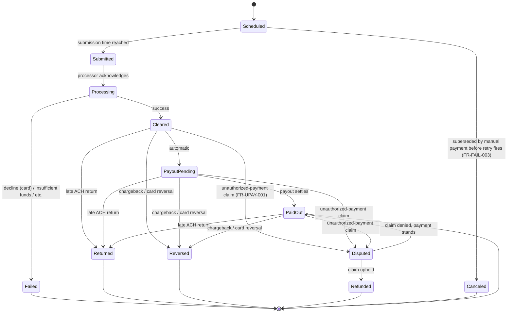
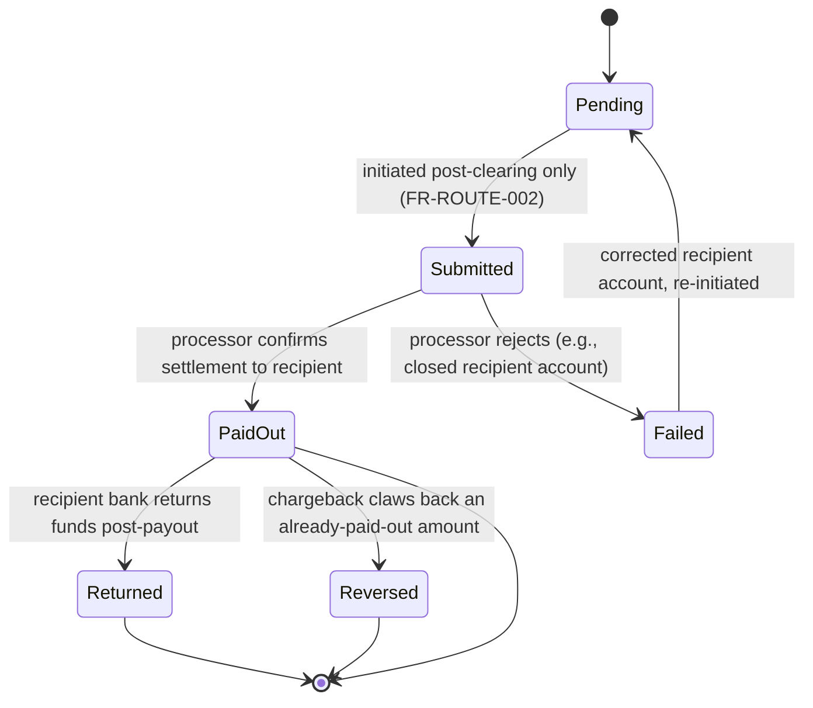

# Payment State Model

Companion to `docs/PAYMENT_ARCHITECTURE.md` (Deliverable 9) and a focused expansion of the payment
and payout machines first introduced in `docs/STATE_MACHINES.md` (Deliverable 8, §2 and §11). This
document is the canonical, detailed reference for payment-side state; `docs/STATE_MACHINES.md`
remains canonical for the other ten machines (agreement, amendment, hardship, partial-payment,
settlement, dispute, identity verification, business verification, appeal, invitation).

No live processor integration exists — every state name and transition below is a design
specification, not a description of a running system.

## 1. Payment attempt lifecycle

Per `docs/DATA_MODEL.md`, each `payment_attempt` row is one attempt at collecting one installment
(or extra/settlement payment). A failed attempt is never mutated into a retry — a new row
(`attempt_kind = 'manual' | 'automatic_retry'`) is created and linked to the same
`installment_schedule_item_id`.



### 1.1 Method-specific nuances

| Aspect | ACH | Debit card |
|---|---|---|
| `Processing → Failed` timing | Can be near-immediate (invalid account) or delayed (bank-side rejection) | Near-immediate (issuer authorization decline) |
| `Cleared → Returned` window | Possible days after apparent clearing (bank-initiated return); exact window is processor/network-dependent | Not applicable — cards use `Reversed` (chargeback) instead, initiated by cardholder via issuer, not the card's own settlement rail |
| `Cleared → Disputed` trigger | Borrower claims the ACH debit was unauthorized (FR-UPAY-001) | Borrower disputes the charge with their card issuer, which typically arrives as `Reversed`-shaped chargeback rather than a pre-resolution `Disputed` step — processor-specific; both branches are modeled since exact card-network dispute-lifecycle granularity depends on the processor selected (open decision #3) |
| Retry behavior | Same `payment_attempt`-per-try model; a fresh ACH debit re-authorization is not required for the single automatic retry since the mandate already covers it | Same model; a card retry may require re-authorization if the original authorization expired |

### 1.2 Invalid transitions (restated from Deliverable 8, with payment-specific emphasis)

- `Scheduled` can never jump directly to `Cleared`/`Processing` — must pass through `Submitted`
  first, so every attempt has a complete, auditable submission record (NFR-AUDIT-001).
- `Failed` is terminal for that specific row — FR-FAIL-006 requires the failed installment history
  to be preserved, which a same-row retry would silently overwrite; a new row is required instead.
- No installment may have more than one open `Scheduled`-kind `automatic_retry` attempt at a time
  (FR-FAIL-003: exactly one retry, enforced by the Scheduler never creating a second retry row
  while an unresolved one exists).
- `PaidOut` cannot revert to `Processing`/`Submitted`; its only forward transitions are the
  clawback branches (`Returned`, `Reversed`, `Disputed`).
- `Refunded` and `Canceled` are terminal — no reopening without a brand-new `payment_attempt`.

### 1.3 Ledger triggers

Every transition below writes at least one `ledger_entry` set (`docs/PAYMENT_ARCHITECTURE.md` §14):

| Transition | Ledger effect |
|---|---|
| `Processing → Cleared` | Posting 1 (clear) |
| `PayoutPending → PaidOut` | Posting 2 (payout) |
| `{Cleared\|PayoutPending} → Returned/Reversed` | Posting 3 (pre-payout full reversal) |
| `PaidOut → Returned/Reversed` | Posting 4 (post-payout clawback exposure) |
| `Disputed → Refunded` | Posting 5 (dispute-resolved reversal) |
| `Disputed → PaidOut` (claim denied) | No reversal — original posting stands |

## 2. Payout lifecycle



**Invalid transitions:** `Pending` can never be entered for a `payment_attempt` that has not
reached `Cleared` — this is the concrete enforcement point for §7's "no funds released before
clearing" rule; `PaidOut` is otherwise terminal except for the clawback branches, which are recorded
as reductions to the recipient's proceeds (ledger posting 4), not as PAY2PAY absorbing the loss
(`docs/PAYMENT_ARCHITECTURE.md` §3).

## 3. Payment-level unauthorized-payment dispute (detail view)

Shown compressed as the `Cleared/PayoutPending/PaidOut → Disputed → {Refunded | PaidOut}` branch in
Section 1; expanded here because it is the specific mechanism FR-UPAY-001 through FR-UPAY-006
describe:

```mermaid
stateDiagram-v2
    [*] --> Claimed: borrower claims charge unauthorized
    Claimed --> FundsFrozenWherePermitted: recoverable unsettled funds frozen (FR-UPAY-002)
    FundsFrozenWherePermitted --> EvidenceSubmitted: agreement, mandate, verification, consent events sent to processor (FR-UPAY-003)
    EvidenceSubmitted --> UnderProcessorReview
    UnderProcessorReview --> Upheld: processor/bank rules for the borrower
    UnderProcessorReview --> Denied: processor/bank rules for the creditor
    Upheld --> [*]: payment_attempt → Refunded; agreement paid balance reduced (FR-UPAY-005)
    Denied --> [*]: payment_attempt → PaidOut (or Cleared); payment stands
```

**Invalid transitions:** the platform never sets `Upheld`/`Denied` itself (FR-UPAY-004) — only a
processor/bank resolution webhook can drive that transition; this dispute record and any
agreement-level `agreement_dispute` about the same installment remain separate rows even when
related (FR-UPAY-006, `docs/DATA_MODEL.md` §1).

---

**Coverage note:** This document satisfies the "payment-state model" deliverable named in the
master spec's introductory paragraph, as a focused companion to the general state-machine coverage
in `docs/STATE_MACHINES.md` (Deliverable 8) and the payment mechanics in `docs/PAYMENT_ARCHITECTURE.md`
(Deliverable 9). No new open decisions were surfaced while writing this — the method-specific
nuances table (§1.1) restates the existing dependency on processor selection (open decision #3)
rather than introducing a new gap.
