# Deliverable 8: State Machines

Source: `docs/PAY2PAY_MASTER_SPEC.md`, primarily Sections 5, 7, 9, 11, 12, 13, 17, 18A, 30. Builds
on `docs/DATA_MODEL.md`. Covers the twelve state machines named in Section 36, Deliverable 8, each
as a Mermaid `stateDiagram-v2` plus an explicit invalid-transitions list. Two machines
(Agreement lifecycle, Witness attestation gating) required a modeling decision where the spec left
a gap; those decisions are called out inline and cross-referenced to `docs/OPEN_DECISIONS.md`.

## 0. Coverage across P2P, B2C, C2B, and B2B

None of the twelve machines below branch on relationship shape — an Agreement's status machine is
identical whether it's P2P, B2C, C2B, or B2B, and the same is true for Payment, Amendment,
Hardship, Partial-payment, Settlement, Dispute, and Invitation. Two machines have a B2B-specific
detail called out explicitly where it applies:

- **Business verification** (Section 5) applies once per `business_profile`; full verification is
  required before either business can receive funds or activate payments (FR-B2B-001), but is not a
  prerequisite for reaching `AwaitingSignatures` or for a business's authorized representative to
  sign. Signing remains subject to every other applicable safeguard: authenticated session, usable
  profile-name information where applicable, a fresh step-up/MFA challenge, agreement-party
  authorization, valid agreement state/version and signing order, prevention of a duplicate
  signature, and — for a business signer — the signing-authority check (FR-B2B-002) described next.
  None of those safeguards are removed or weakened. The machine itself is unchanged per business.
- **Identity verification** for a B2B signer is about the **authorized representative's** personal
  identity plus a separate authority check (FR-B2B-002) — the person-level machine (Section 5) is
  the same machine, just paired with the business-level authority validation described in its notes.

## 1. Agreement lifecycle

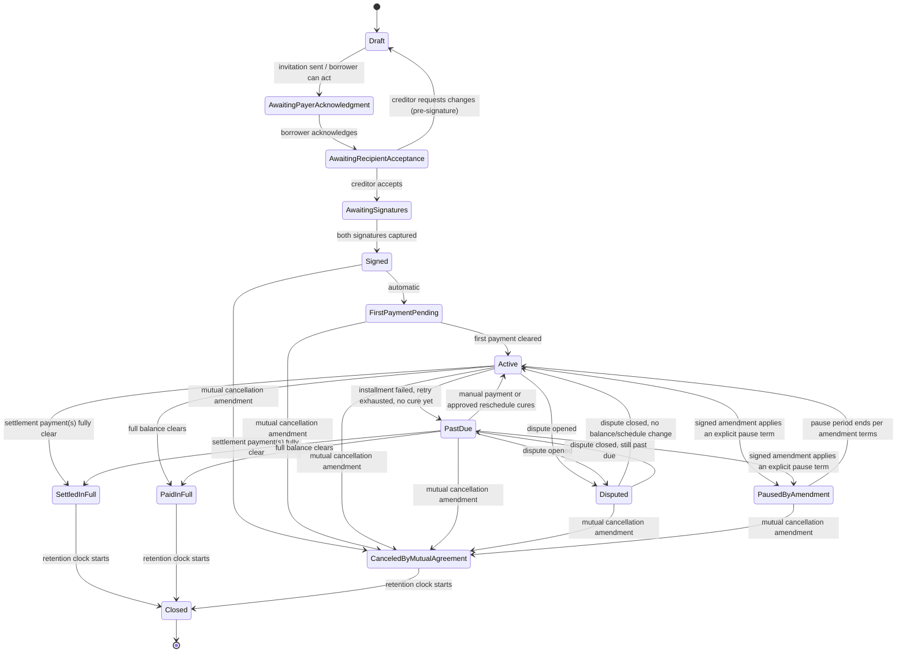

**Modeling decision (resolves open decision #10):** the spec lists `Paused by amendment` as a
distinct status but never states whether merely *submitting* a hardship/partial-payment/settlement
request pauses the agreement. This model keeps the agreement in its current status
(`Active`/`Past due`) while such a request is under negotiation — consistent with FR-HARD-003
("the existing agreement remains controlling until both parties sign an amendment") — and only
transitions to `Paused by amendment` once a **signed amendment** whose terms include an explicit
payment pause takes effect. Hardship/partial-payment/settlement negotiation status itself lives on
the request record (Sections 4–6 below), not on the agreement. This is a design resolution, not a
spec-stated rule; flagged for confirmation.

**Invalid transitions:**
- `Draft` cannot go directly to `Signed`, `Active`, or any post-signature state — must pass through
  acknowledgment, acceptance, and signatures in order.
- Once `Signed`, the agreement can never return to `Draft` or any pre-signature state (FR-AGR-006).
- `Closed` is terminal — no outgoing transitions.
- `PaidInFull` and `SettledInFull` do not transition back to `Active` under this model. **Edge
  case not addressed by the spec:** if a payment is reversed after the agreement reached
  `PaidInFull`/`SettledInFull` (per FR-UPAY-005, "a reversed payment reduces the agreement's paid
  balance"), the spec does not say whether the agreement should reopen. Logged as a new open
  decision (see `docs/OPEN_DECISIONS.md` #17).
- `AwaitingRecipientAcceptance` cannot skip to `Signed` without passing through
  `AwaitingSignatures` (separates "acceptance" from "signature," per FR-AGR-004/005).

## 2. Payment (attempt) lifecycle

Per `docs/DATA_MODEL.md`, each `payment_attempt` row is one attempt; a failed attempt is not
mutated into a retry — a new `payment_attempt` row (kind = `automatic_retry` or `manual`) is
created and linked to the same `installment_schedule_item`.

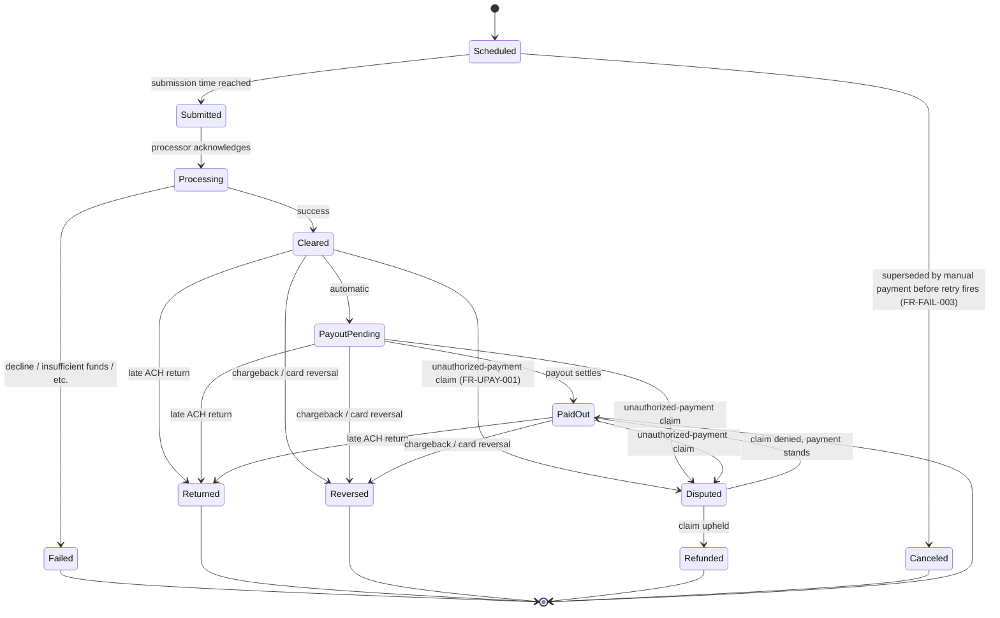

**Invalid transitions:**
- `Scheduled` cannot move directly to `Cleared`/`Processing` — must pass through `Submitted`
  (idempotent, auditable processing per FR-MONEY-002).
- `Failed` is terminal **for that attempt row**; a retry or manual payment is a distinct new
  `payment_attempt`, never a mutation of the failed row (preserves FR-FAIL-006's history
  requirement cleanly).
- `PaidOut` cannot revert to `Processing` or `Submitted`.
- No installment's schedule may have more than one `Scheduled`-kind `automatic_retry` attempt open
  at a time (FR-FAIL-003: exactly one retry).
- `Refunded` and `Canceled` are terminal.

## 3. Amendment lifecycle

The generic wrapper any accepted hardship/partial-payment/settlement/general-change request feeds
into (Section 3, "any contractual change requires both parties' approval").

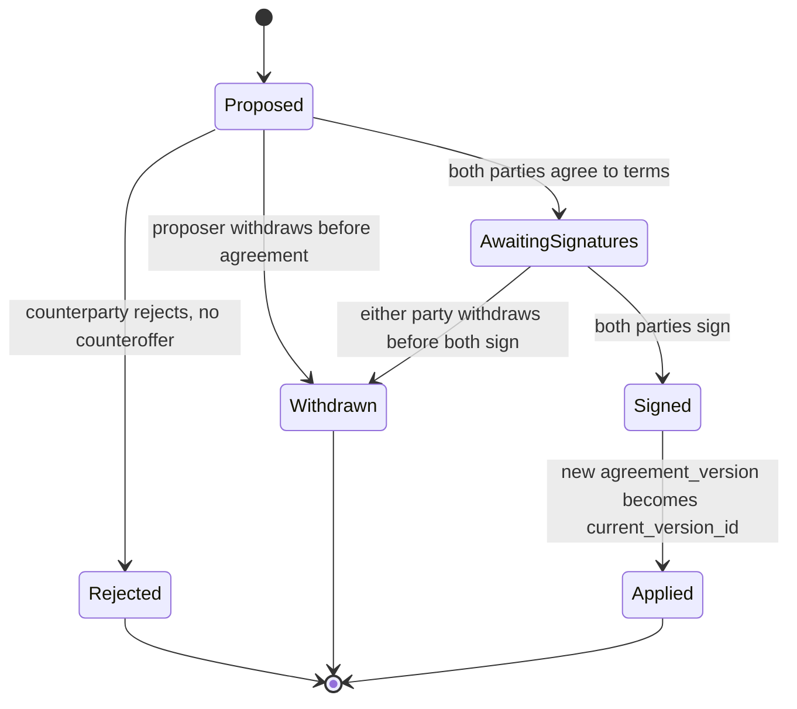

**Invalid transitions:**
- `Applied` is terminal and immutable — an applied amendment's resulting `agreement_version` is
  never edited in place (FR-AGR-006), only superseded by a further amendment.
- `AwaitingSignatures` cannot skip to `Applied` without `Signed` — signature capture (FR-SIG-001)
  is mandatory for every amendment, same as the original agreement.
- A `Rejected` or `Withdrawn` amendment can never later become `Applied` — a fresh request must be
  submitted to reopen negotiation.

## 4. Hardship request

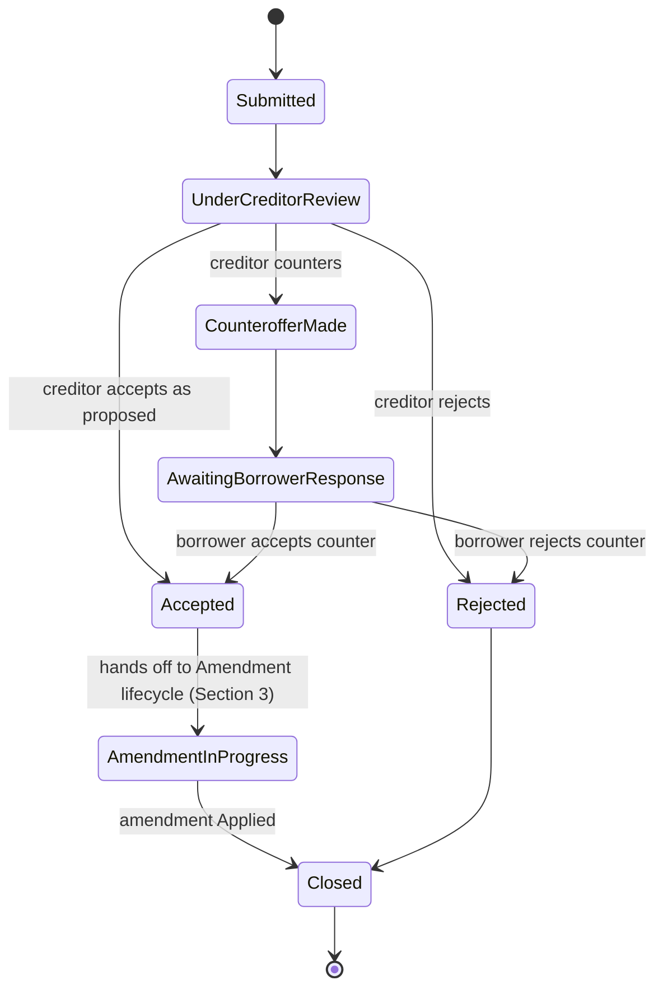

**Invalid transitions:** a request cannot move from `Rejected` back to `UnderCreditorReview`; no
interest/growth/penalty term may appear in the terms carried into `AmendmentInProgress`
(FR-HARD-004) — this is enforced by the Amendment lifecycle's term validation, not a state per se.

## 5. Partial-payment request

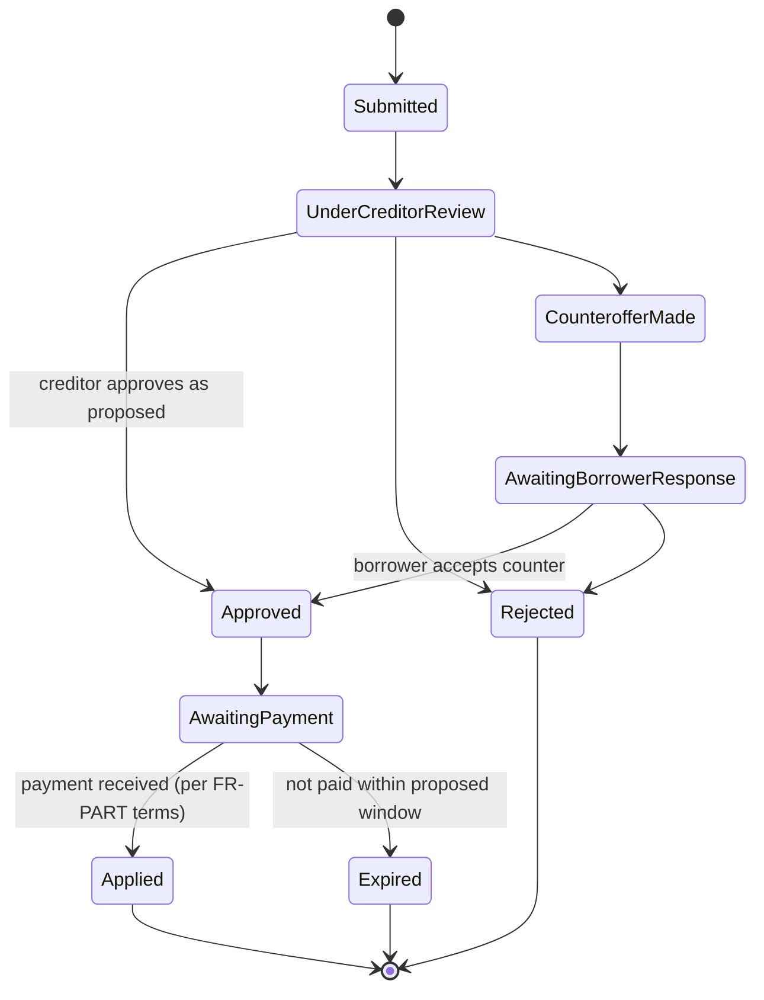

**Invalid transitions:** `Approved` (pre-approval) never implies the remaining balance is forgiven
— that requires a separate Settlement (FR-PART-004); `Applied` does not itself change agreement
status beyond recording the partial payment against the installment.

## 6. Settlement

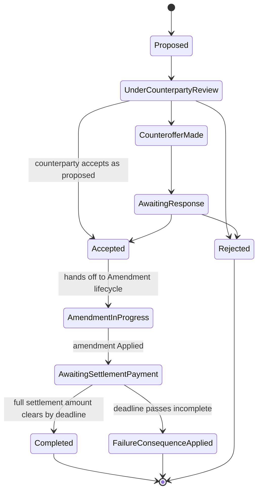

**Invalid transitions:** `Completed` requires the *full* settlement amount to have cleared, not a
partial amount (FR-SETL-001/003); `FailureConsequenceApplied` must apply exactly the consequence
chosen at proposal time (FR-SETL-004) — the system cannot substitute a different consequence at
failure time.

## 7. Dispute (agreement-level)

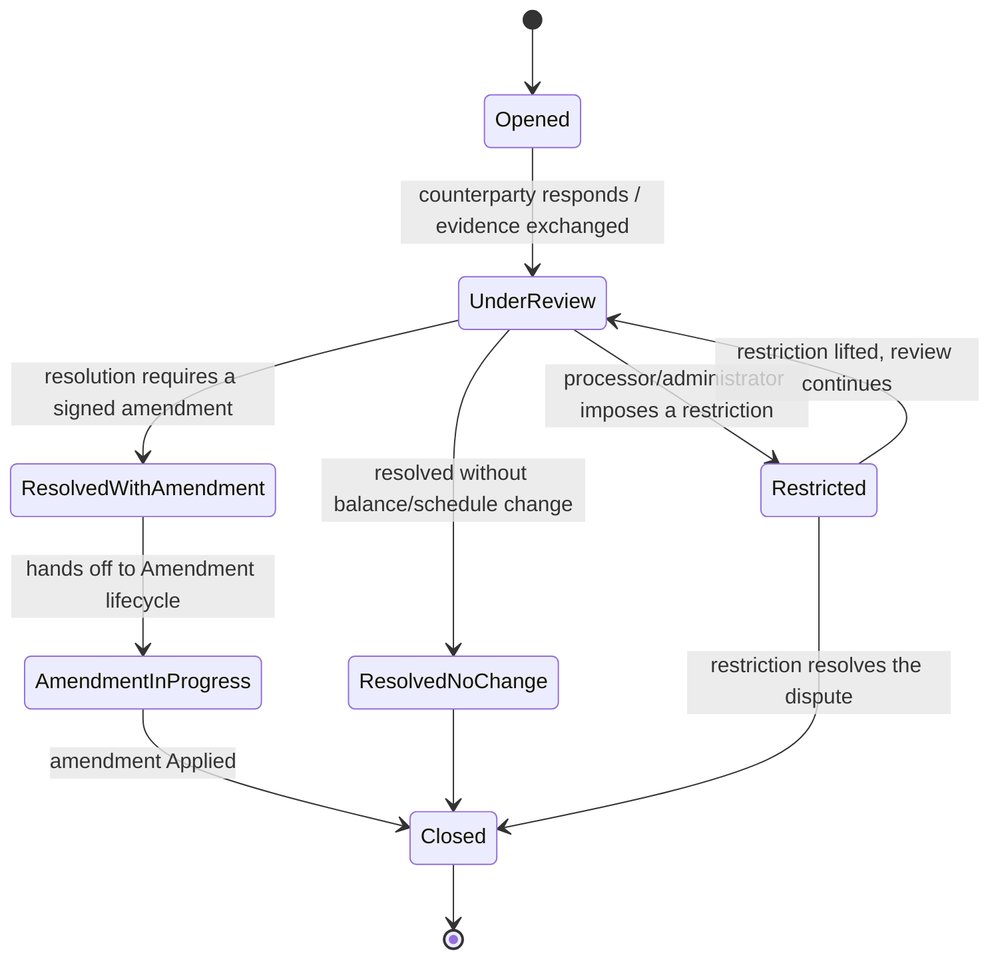

Payment-level **unauthorized-payment claim** is a separate, smaller machine (FR-UPAY-006), already
shown as the `Cleared/PayoutPending/PaidOut → Disputed → {Refunded | PaidOut}` branch in Section 2
above — it is not nested inside this agreement-level dispute machine.

**Invalid transitions:** the platform never sets a terminal state that declares a party "legally
correct" (FR-DISP-004) — `ResolvedNoChange` and `ResolvedWithAmendment` record an outcome, not a
fault determination; scheduled payments are not blocked by `Opened`/`UnderReview` status alone
(FR-DISP-003) — only `Restricted` (or an independent borrower ACH revocation) affects collections.

## 8. Identity verification (personal)

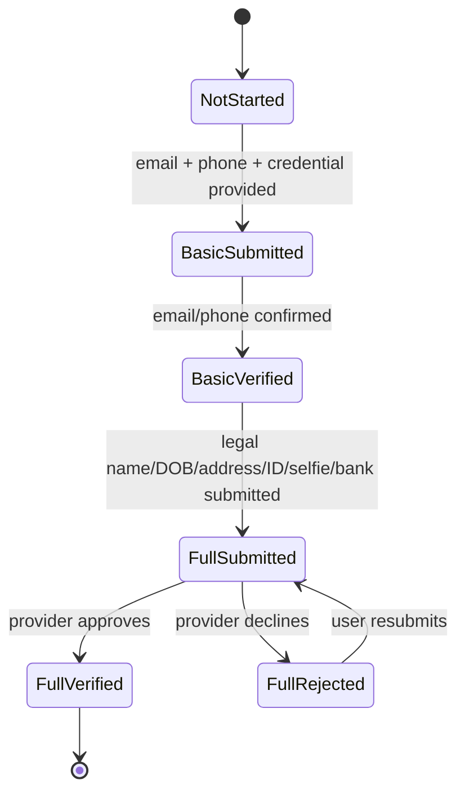

**Invalid transitions:** `NotStarted`/`BasicSubmitted` cannot gate straight to `FullVerified` —
Basic must complete first (§17 ordering); an underage applicant (FR-IDV-003) is blocked before
`FullSubmitted` can be reached at all, regardless of document validity; `FullVerified` does not
silently downgrade — a later problem (e.g., a disputed identity) is handled via
`account_restriction` (Section 12), not by reverting this state machine.

## 9. Business verification (KYB)

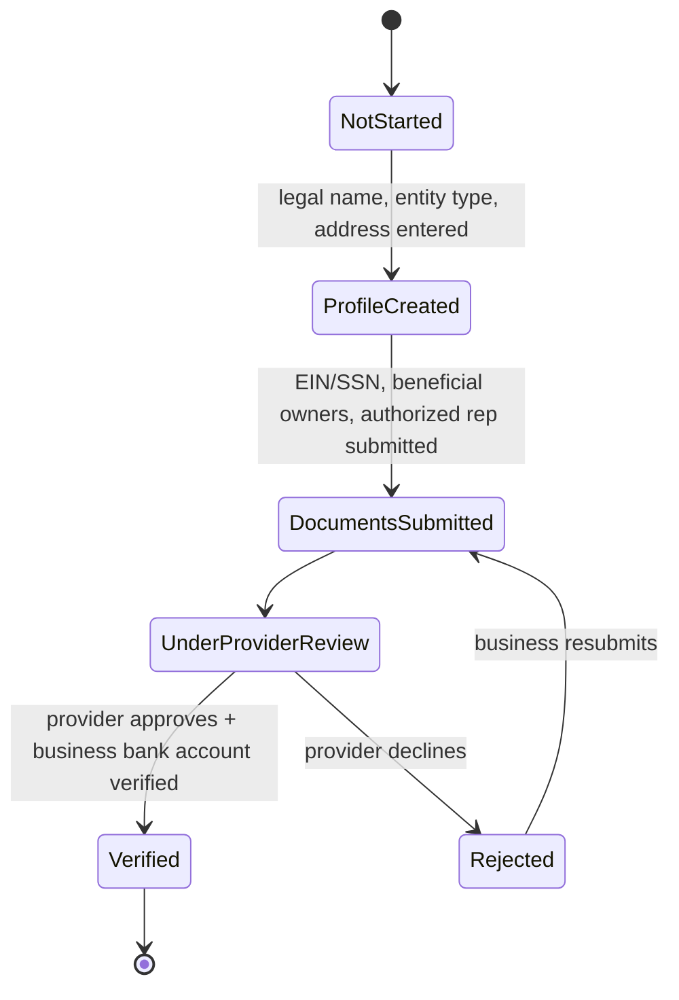

**B2B note:** reaching `AwaitingSignatures` (Agreement lifecycle) does not require either business
to have reached `Verified` here — full business verification is not a prerequisite to sign. Both
businesses must independently reach `Verified` here (FR-B2B-001) before either can receive funds or
activate live payment capability; this machine runs once per `business_profile`, not once per
agreement.

**Invalid transitions:** `ProfileCreated` alone (no documents) never satisfies the Full-verification
gate required to receive funds or activate payments (FR-IDV-002) — this gate does not apply to
signing, which has its own separate safeguards (Section 0 above); a change of authorized
representative (FR-B2B-009) does not reset `Verified` back to an earlier state.

## 10. Appeal

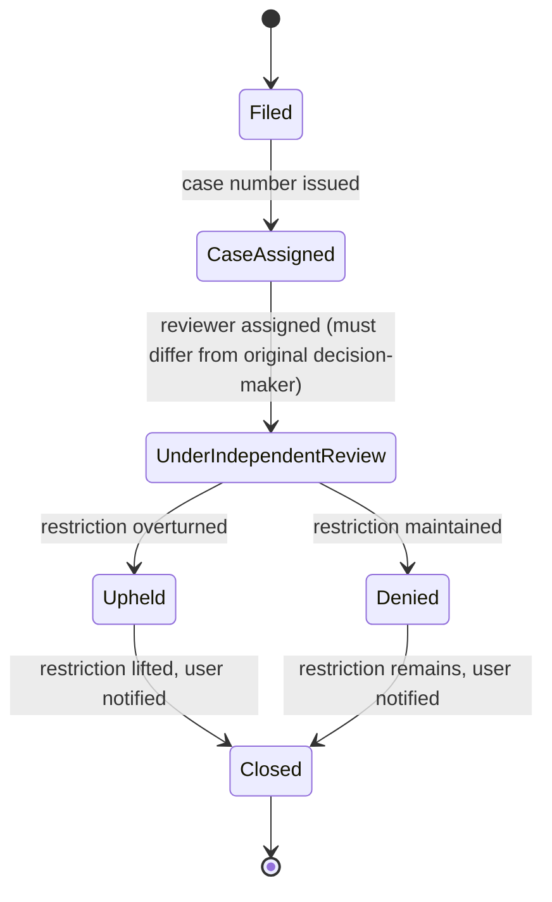

**Invalid transitions:** `UnderIndependentReview`'s reviewer can never be the same
administrator/compliance-reviewer who applied the original restriction (Section 30 explicit
separation-of-duties requirement) — enforced by a check comparing `appeal_case.reviewer_admin_id`
against `account_restriction.applied_by_admin_id`; the underlying `account_restriction` stays
`active` throughout `Filed`/`CaseAssigned`/`UnderIndependentReview` unless a reviewer affirmatively
lifts it early (FR-APPEAL-003) — filing alone never auto-suspends the restriction.

## 11. Payout

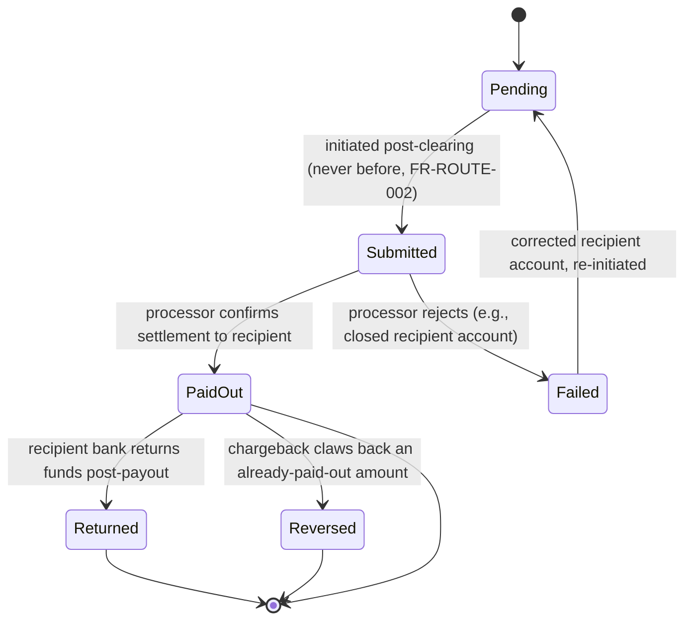

**Invalid transitions:** `Pending` can never be entered for a `payment_attempt` that has not
reached `Cleared` (FR-ROUTE-002 — no advances, no instant access to unsettled funds); `PaidOut` is
otherwise terminal except for the `Returned`/`Reversed` clawback branches, which reduce the
recipient's recorded proceeds per FR-UPAY-005's reversal rule rather than being modeled as a
"successful payout" continuing to hold.

## 12. Invitation

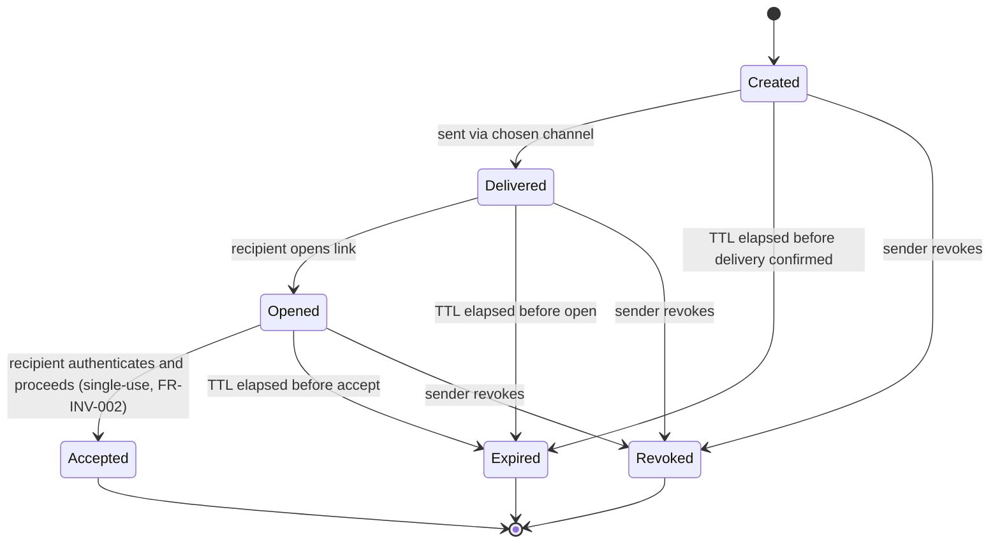

**Invalid transitions:** `Accepted` is terminal and single-use — a second acceptance attempt on the
same token is rejected regardless of token validity otherwise (FR-INV-002); an `Expired` or
`Revoked` invitation cannot be resurrected — a new invitation must be created; acceptance is only
valid if the authenticating identity matches the invitation's bound email/phone where one was
specified (forwarded-link protection, FR-INV-004) — a mismatch is rejected rather than silently
reassigning the invitation.

## 13. Witness attestation gating (supporting note, not a Section-36-named machine)

Because `docs/OPEN_DECISIONS.md` item #9 (witness verification tier) directly affects whether
Witness attestation has a precondition state, this model requires a witness to reach
`BasicVerified` (Section 8 above) before `witness_attestation` can be recorded — attesting is
treated like any other authenticated in-app action, not a funds- or ID-handling action, so Full
verification is not required. This is a design resolution proposed to unblock modeling, not a
closed decision — retained as open decision #9 pending product/legal confirmation.

---

**Coverage note:** All twelve machines named in Section 36, Deliverable 8, are covered above,
uniformly across P2P/B2C/C2B/B2B (Section 0). One new open decision was surfaced (post-close
payment reversal reopening, #17); two prior open decisions (#9 witness verification tier, #10
paused-by-amendment trigger) were given explicit **design resolutions** here to make the machines
usable, but remain logged as pending confirmation rather than treated as settled spec fact.

*Deliverables 6–8 complete. Remaining: Deliverable 9 (Payment architecture) through Deliverable 15
(Development work breakdown).*
